# REVIEW: genesis_sdlc Graph Topology

**Author**: Claude Code
**Date**: 2026-03-17
**Addresses**: genesis_sdlc package graph definition — `gtl_spec/packages/genesis_sdlc.py`
**For**: all

## Summary

Topology of the genesis_sdlc SDLC graph as rendered directly from `package.to_mermaid()`. Shows asset types, operative conditions, edge operators, and the co-evolve relationship between `code` and `unit_tests`. This is static topology — not traversal state.

## Graph Topology

```mermaid
graph LR
  classDef governed fill:#ffeeba,stroke:#d4a017
  classDef product  fill:#d4edda,stroke:#28a745
  classDef coevolve fill:#cce5ff,stroke:#004085

  intent["intent"]
  requirements(["requirements\noperative: approved"])
  feature_decomp(["feature decomp\noperative: approved"])
  design(["design\noperative: approved and not superseded"])
  code["code"]
  unit_tests["unit tests"]
  uat_tests["uat tests"]

  intent --|claude_agent, human_gate [markov]|--> requirements
  requirements:::governed
  requirements --|claude_agent, human_gate [markov]|--> feature_decomp
  feature_decomp:::governed
  feature_decomp --|claude_agent, human_gate [markov]|--> design
  design:::governed
  design --|claude_agent, check_impl [markov]|--> code
  code <-->|co_evolve| unit_tests
  code:::coevolve
  unit_tests:::coevolve
  unit_tests --|claude_agent, human_gate [markov]|--> uat_tests
  uat_tests:::governed
```

## Asset Definitions

| Asset | ID Format | Markov Conditions | Operative |
|-------|-----------|-------------------|-----------|
| `intent` | INT-{SEQ} | problem_stated, value_proposition_clear, scope_bounded | — |
| `requirements` | REQ-{SEQ} | keys_testable, intent_covered, no_implementation_details | approved |
| `feature_decomp` | FD-{SEQ} | all_req_keys_covered, dependency_dag_acyclic, mvp_boundary_defined | approved |
| `design` | DES-{SEQ} | adrs_recorded, tech_stack_decided, interfaces_specified, no_implementation_details | approved and not superseded |
| `code` | CODE-{SEQ} | implements_tags_present, importable, no_v2_features | — |
| `unit_tests` | TEST-{SEQ} | all_pass, validates_tags_present | — |
| `uat_tests` | UAT-{SEQ} | sandbox_install_passes, e2e_scenarios_pass, accepted_by_human | — |

## Edge Evaluators

| Edge | F_D | F_P | F_H |
|------|-----|-----|-----|
| `intent→requirements` | — | — | intent_approved |
| `requirements→feature_decomp` | req_coverage | decomp_complete | decomp_approved |
| `feature_decomp→design` | — | design_coherent | design_approved |
| `design→code` | impl_tags | code_complete | — |
| `code↔unit_tests` | tests_pass, validates_tags, e2e_tests_exist | coverage_complete | — |
| `unit_tests→uat_tests` | uat_sandbox_report | uat_e2e_passed | uat_accepted |

## Notes

- **Yellow nodes** (governed) require a `review_approved` event to converge their F_H evaluator.
- **Blue nodes** (co-evolve) — `code` and `unit_tests` are mutually mutable in the same `iterate()` call. Structurally enforced: `co_evolve=True` requires `source: [code, unit_tests]`.
- **`design`** is `operative: approved and not superseded` — the strictest operative condition; a superseded design blocks downstream work even if previously approved.
- This topology is fixed for V1. Profiles (poc, hotfix, etc.) are `Overlay(restrict_to=[...])` — a restriction on this graph, not a separate graph.

## Recommended Action

For reference only — no action required. Current workspace is fully converged at delta=0 across all 6 edges.
