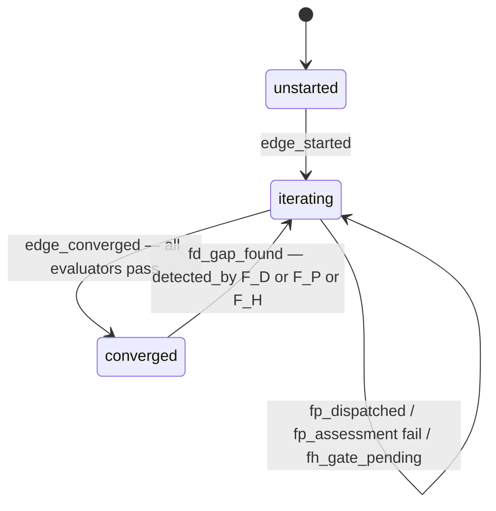
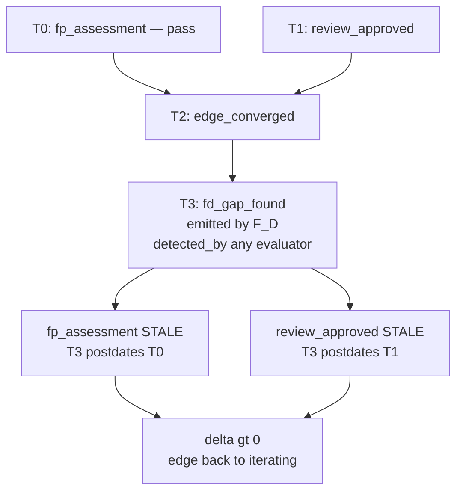

# STRATEGY: Edge Invalidation via Existing `fd_gap_found` Primitive

**Author**: Claude Code
**Date**: 2026-03-20T00:27:17Z
**Addresses**: Canonical mechanism for forcing edge retraversal; immutable CRUD on convergence state
**For**: all

## Summary

The engine currently has no way to invalidate prior convergence (F_H `review_approved` or F_P `fp_assessment`) by appending to the event stream. The `fd_gap_found` event already exists and is F_D-emitted — making it the correct primitive. The gap is solely in the projection: `bind.py` does not check whether a `fd_gap_found` postdates prior passing events. No new primitive is required; one projection rule per evaluator type closes it.

---

## Problem: Immutable CRUD and the Missing Update Rule

An append-only event stream implements CRUD as follows:

| Operation | Mutable store | Immutable event stream |
|-----------|--------------|------------------------|
| Create    | INSERT        | emit event             |
| Read      | SELECT        | project stream         |
| Update    | UPDATE row    | emit superseding event → projection picks latest |
| Delete    | DELETE row    | emit tombstone → projection ignores prior |

Current `bind.py` projection implements Create and Read correctly. It does not implement Update or Delete — once a `review_approved` or `fp_assessment(pass)` exists in the stream, it is permanent regardless of subsequent gap signals. This makes converged edges unresettable without out-of-band mutation (which violates append-only invariant) or a version bump (which changes `spec_hash` and is a side-effect, not an intent).

---

## Root Cause: Authority and Write Path Are Already Correct

The write-path invariant (bootloader §V) states:

> F_P constructs artifacts and assessment payloads; the F_D engine reads them, computes delta, and calls the logger. F_P does not call the event logger.

`fd_gap_found` is already emitted by F_D. Detection can originate from any evaluator type — F_H (human flags a problem), F_P (agent finds incoherence), F_D (test fails) — but the event is always written by F_D. The authority chain is already correct:

```
Detection(F_H | F_P | F_D) → F_D.emit(fd_gap_found)
```

The event carries edge scope. The `detected_by` field (if not already present) should carry the originating evaluator category for audit traceability on the trace surface. This does not affect control-surface semantics.

---

## Edge Lifecycle State Model



`fd_gap_found` is the sole transition from `converged → iterating`. This is the Update/tombstone operation in immutable CRUD terms.

---

## Invalidation Sequence



---

## Required Projection Rule Changes (bind.py)

Two guards, one per evaluator type that can converge:

**F_H (bind_fh):**
```
review_approved is valid
  IF no fd_gap_found for that edge postdates it
```

**F_P:**
```
fp_assessment(pass) is valid
  IF spec_hash matches current job hash
  AND no fd_gap_found for that edge postdates it
```

F_D needs no change — it re-runs its command on every evaluation and is never cached.

---

## Full Reset (All Edges)

Emit `fd_gap_found` once per edge to be reset, or support `edge: "*"` in the payload as a wildcard that the projection interprets as "invalidate all edges for this feature." The wildcard form is a convenience — the projection rule is identical; matching just broadens to all edges.

---

## What Is Not Required

- No new event type (`convergence_invalidated` was considered — `fd_gap_found` already covers it)
- No mutation of the event stream
- No version bump as a side-effect
- No feature YAML deletion

---

## Recommended Action

1. Confirm `fd_gap_found` payload schema includes `detected_by` field (add if absent — trace surface, no control semantics change)
2. Update `bind_fh` in abiogenesis `bind.py`: add postdating `fd_gap_found` check
3. Update F_P binding in abiogenesis `bind.py`: add same postdating check alongside existing `spec_hash` check
4. Support `edge: "*"` wildcard in `fd_gap_found` projection for full-graph reset
5. Release abiogenesis with these changes
6. To reset genesis-manager: emit `fd_gap_found` per edge (or wildcard) via `python -m genesis emit-event`
