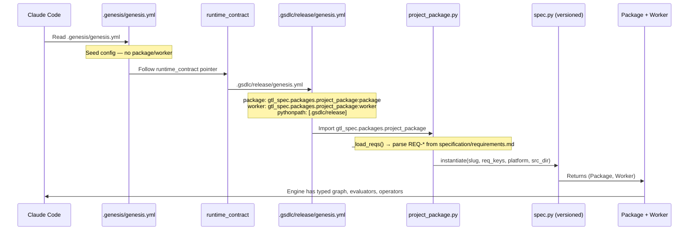
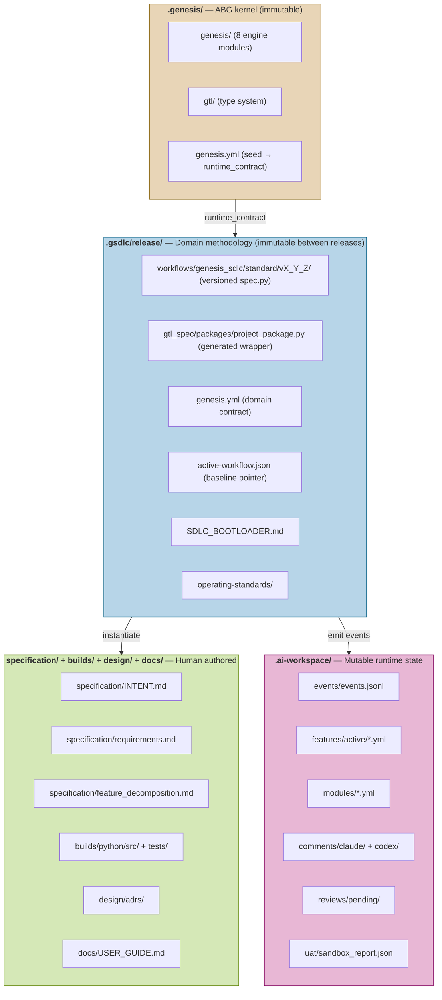
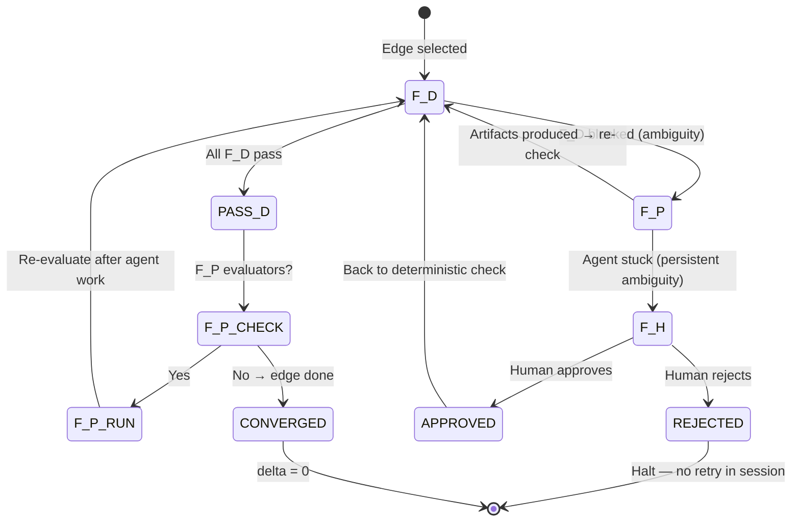
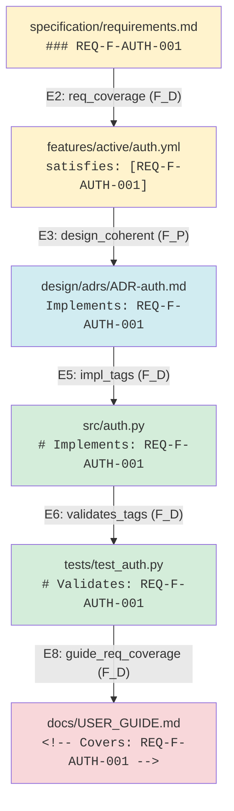
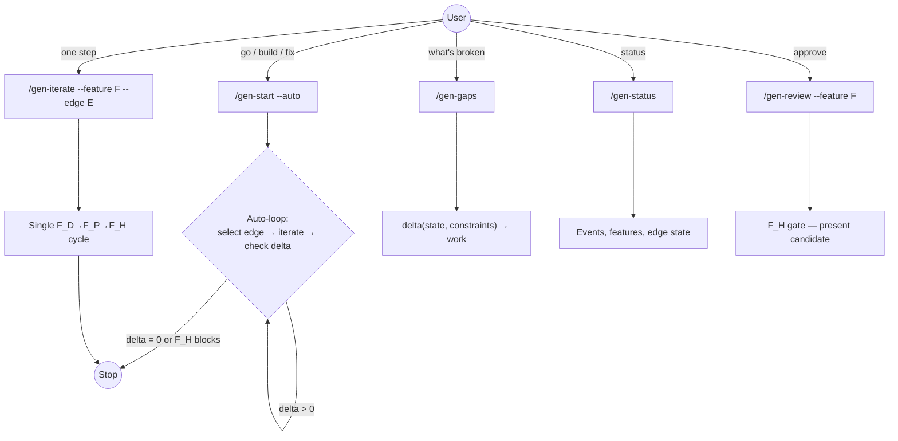
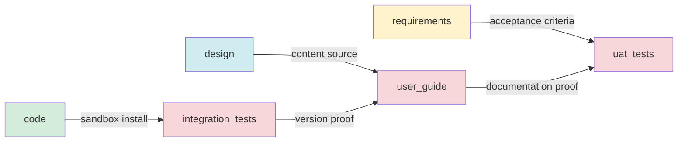

# REVIEW: SDLC Workflow Interim Walkthrough — Boot Chain, Graph, and Iterate Loop

**Author**: Claude
**Date**: 2026-03-23T01:30:00+11:00
**Addresses**: `sdlc_graph.py`, `install.py`, `.gsdlc/release/`, `.genesis/`
**For**: all
**Status**: INTERIM — captures state after ABG v1.0 + installer deconstruction fixes

---

## 1. Boot Chain

How a cold Claude Code session becomes operational.



**Key insight**: `.genesis/genesis.yml` is a pointer, not a config. ABG writes it as a seed. The GSDLC installer writes `runtime_contract: .gsdlc/release/genesis.yml` into it. That single line connects kernel to domain.

---

## 2. Territory Model

Four territories with distinct ownership and mutation rules.



**Ownership rules**:
| Territory | Owner | Write rule |
|-----------|-------|------------|
| `.genesis/` | ABG installer only | Never edit directly |
| `.gsdlc/release/` | GSDLC installer only | Never edit between releases |
| `specification/` + `builds/` + `design/` + `docs/` | Human + agents | Editable — authored content |
| `.ai-workspace/` | Agents via `emit()` | Append-only events, territory-partitioned posts |

---

## 3. SDLC Graph Topology

10 assets, 9 edges. The spec/design boundary sits at `feature_decomp → design`.

```mermaid
graph LR
    INT[intent<br/><i>INT-*</i>]
    REQ[requirements<br/><i>REQ-*</i>]
    FD[feature_decomp<br/><i>FD-*</i>]
    DES[design<br/><i>DES-*</i>]
    MOD[module_decomp<br/><i>MOD-*</i>]
    CODE[code<br/><i>CODE-*</i>]
    UT[unit_tests<br/><i>TEST-*</i>]
    IT[integration_tests<br/><i>ITEST-*</i>]
    UG[user_guide<br/><i>GUIDE-*</i>]
    UAT[uat_tests<br/><i>UAT-*</i>]

    INT -->|"E1: F_H gate"| REQ
    REQ -->|"E2: F_D + F_P + F_H"| FD
    FD -->|"E3: F_P + F_H"| DES
    DES -->|"E4: F_D + F_P + F_H"| MOD
    MOD -->|"E5: F_D + F_P"| CODE
    CODE <-->|"E6: co-evolve<br/>F_D + F_P"| UT
    UT -->|"E7: F_D + F_P"| IT
    IT -->|"E8: F_D + F_P + F_H"| UG
    UG -->|"E9: pure F_H"| UAT

    style INT fill:#fff3cd,stroke:#856404
    style REQ fill:#fff3cd,stroke:#856404
    style FD fill:#fff3cd,stroke:#856404
    style DES fill:#d1ecf1,stroke:#0c5460
    style MOD fill:#d1ecf1,stroke:#0c5460
    style CODE fill:#d4edda,stroke:#155724
    style UT fill:#d4edda,stroke:#155724
    style IT fill:#f8d7da,stroke:#721c24
    style UG fill:#f8d7da,stroke:#721c24
    style UAT fill:#f8d7da,stroke:#721c24
```



**Colour key**:
- Yellow: WHAT (specification territory — tech-agnostic)
- Blue: WHAT→HOW boundary (design territory)
- Green: HOW (implementation territory — tech-bound)
- Red: ACCEPTANCE (validation + release gate)

### Edge Detail Table

| # | Edge | Evaluators | Gate |
|---|------|-----------|------|
| E1 | intent → requirements | `intent_approved` (F_H) | Human confirms scope |
| E2 | requirements → feature_decomp | `req_coverage` (F_D), `decomp_complete` (F_P), `decomp_approved` (F_H) | REQ coverage + human |
| E3 | feature_decomp → design | `design_coherent` (F_P), `design_approved` (F_H) | ADRs + human |
| E4 | design → module_decomp | `module_coverage` (F_D), `module_schedule` (F_P), `schedule_approved` (F_H) | DAG + human |
| E5 | module_decomp → code | `impl_tags` (F_D), `code_complete` (F_P) | Tag check + agent |
| E6 | code ↔ unit_tests | `tests_pass` (F_D), `validates_tags` (F_D), `e2e_tests_exist` (F_D), `coverage_complete` (F_P) | pytest + tags |
| E7 | unit_tests → integration_tests | `sandbox_report_exists` (F_D), `sandbox_e2e_passed` (F_P) | Sandbox proof |
| E8 | integration_tests → user_guide | `guide_version_current` (F_D), `guide_req_coverage` (F_D), `guide_content_certified` (F_P) | Version + coverage |
| E9 | user_guide → uat_tests | `uat_accepted` (F_H) | Human final gate |

---

## 4. Evaluator Escalation — The Iterate Loop

Every edge converges through the same loop: `iterate(job, evaluator_fn, asset) → (Asset, WorkingSurface)`.



**Dispatch contract**: The manifest JSON at `fp_manifest_path` is the authoritative F_P dispatch. It carries structured fields (source/target assets, markov conditions, evaluators, contexts, delta). The `prompt` field is a human-readable render. CLAUDE.md is transport convenience.

**Key rule**: F_P does NOT call the event logger. F_P produces artifacts; F_D reads them and emits events.

---

## 5. Traceability Thread

REQ keys are the traceable thread from specification to runtime.



**Coverage is computable without LLM**: parse REQ keys from requirements.md, check `satisfies:` in feature vectors, grep `# Implements:` and `# Validates:` tags in source/tests, parse `<!-- Covers: -->` in guide. These are all F_D evaluators.

---

## 6. Workflow Commands



---

## 7. Open Design Issues

### 7.1 Edge Topology — Edges 7-9

**Current** (as coded):
```
unit_tests → integration_tests → user_guide → uat_tests
```

**Problem**: This implies integration tests come from unit tests and user guide comes from integration tests. The actual dependency is:
- **integration_tests** should source from **code** (sandbox install + e2e)
- **user_guide** should source from **design** (content) + **integration_tests** (version proof)
- **uat_tests** should source from **requirements** (acceptance) + **user_guide** (documentation proof)



**Status**: Not yet fixed in sdlc_graph.py. The graph is informational — the real graph comes from spec. This is a design decision to be resolved.

### 7.2 active-workflow.json Placement

Currently at `.gsdlc/release/active-workflow.json` — but this is immutable territory and the file is a mutable pointer. It should either:
- Move to `.ai-workspace/` (mutable territory), or
- Be acknowledged as a controlled exception (installer writes it, nothing else does)

### 7.3 Bootloader Version Reconciliation

Python build ships SDLC_BOOTLOADER v1.1.0. Codex build had v1.2.0. The Codex build is being deleted but any content from v1.2.0 that's valid should be merged up.

### 7.4 builds/python/ Path Duplication in instantiate()

`instantiate()` generates paths like `builds/python/src/` and `builds/python/tests/`. But from the installed project's perspective, the layout is just `src/` and `tests/` (no `builds/` prefix). The top-level module-scope operators use `src/` and `tests/` (correct for installed context), but `instantiate()` rebuilds them as `builds/{platform}/{src_dir}` — which is the source repo layout, not the installed layout.

---

## Summary

The SDLC workflow is architecturally sound: typed graph, evaluator escalation, event stream, traceability. The boot chain is correct once `runtime_contract` wiring is in place. The installer fixes from this session (Finding 1-5 in the deconstruction review) are necessary and sufficient for a clean install.

Remaining work:
1. Edge 7-9 topology redesign
2. active-workflow.json territory decision
3. `instantiate()` path resolution (source repo vs installed layout)
4. Clean install end-to-end validation
