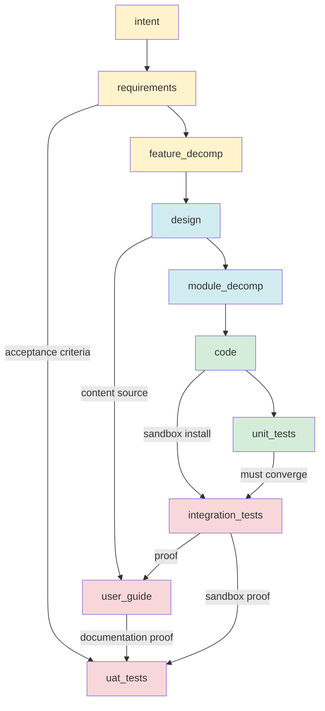
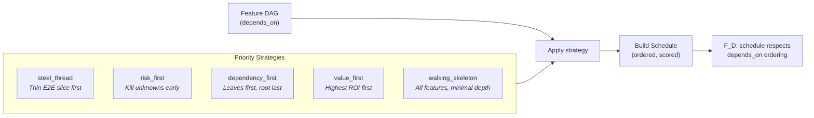
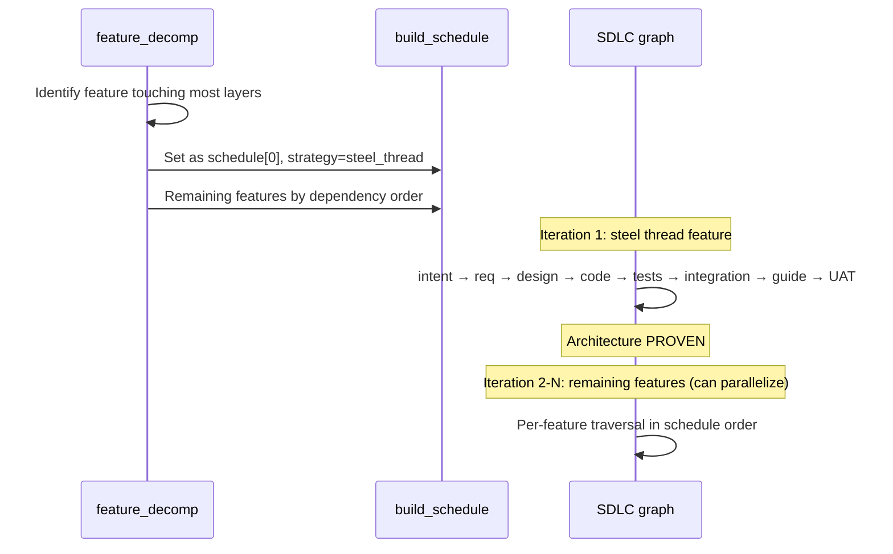

# STRATEGY: DAG Topology and Priority Methodology Redesign

**Author**: Claude
**Date**: 2026-03-23T02:00:00+11:00
**Addresses**: `sdlc_graph.py` — graph topology, feature_decomp, module_decomp
**For**: all

---

## Problem

The SDLC graph was a linear pipeline masquerading as a typed topology:

```
intent → requirements → feature_decomp → design → module_decomp → code ↔ unit_tests
    → integration_tests → user_guide → uat_tests
```

This encodes waterfall into the type system. Real dependency graphs are DAGs — assets have multiple sources where the real-world dependency demands it.

Additionally, intermediate assets (feature_decomp, module_decomp) were treated as checkboxes on a conveyor belt rather than as producers of structured, F_D-verifiable artifacts. No dependency ordering, no build scheduling, no priority strategy selection.

---

## Redesign: DAG Topology



### Edge changes

| Edge | Was | Now | Why |
|------|-----|-----|-----|
| E7 | `unit_tests → integration_tests` | `[code, unit_tests] → integration_tests` | You install the CODE in a sandbox. Unit tests are a gate, not a source. |
| E8 | `integration_tests → user_guide` | `[design, integration_tests] → user_guide` | Guide documents what was DESIGNED, verified by what integration PROVED. |
| E9 | `user_guide → uat_tests` | `[requirements, user_guide, integration_tests] → uat_tests` | Acceptance criteria live in the SPEC. Guide + sandbox are evidence. |

Multi-source edges: the engine checks all sources have converged before firing the edge. This is how GTL already works (see `e_tdd` with `source=[code, unit_tests]`).

---

## Redesign: Structured Intermediate Artifacts

### feature_decomp produces

```
.ai-workspace/features/active/
├── FD-001-auth.yml          # id, name, satisfies, depends_on
├── FD-002-storage.yml
└── ...

.ai-workspace/features/build_schedule.json
{
  "priority_strategy": "steel_thread",
  "mvp_boundary": ["FD-001", "FD-003"],
  "schedule": [
    {"id": "FD-001", "depends_on": [], "priority_score": 9, "rationale": "touches all layers"},
    {"id": "FD-003", "depends_on": ["FD-001"], "priority_score": 7, "rationale": "core storage"},
    {"id": "FD-002", "depends_on": ["FD-001"], "priority_score": 5, "rationale": "secondary auth"}
  ]
}
```

**F_D validates**:
- `req_coverage` — every REQ key in ≥1 feature vector
- `feature_dag_acyclic` — dependency DAG has no cycles
- `build_schedule_valid` — schedule respects depends_on, valid strategy selected

### module_decomp produces

```
.ai-workspace/modules/
├── MOD-001-core.yml          # id, implements_features, depends_on, rank, interfaces
├── MOD-002-auth.yml
└── ...
```

**F_D validates** (already existed):
- `module_coverage` — every feature assigned to ≥1 module
- DAG acyclicity via markov condition
- Build order via rank field

---

## Priority Strategies

Declared in `specification/INTENT.md`. Applied during feature_decomp by F_P. Validated by F_D.



### Strategy semantics

| Strategy | First feature | Build order | When to use |
|----------|--------------|-------------|-------------|
| **steel_thread** | Touches all architectural layers | E2E proof first, then fan out | New architecture, unproven stack |
| **risk_first** | Highest uncertainty × impact | Kill risks early, predictable late | Complex domain, many unknowns |
| **dependency_first** | Leaf nodes (no dependencies) | Pure topological sort | Well-understood domain, clear DAG |
| **value_first** | Highest business value / effort | ROI-ordered | Product-driven, time-to-market pressure |
| **walking_skeleton** | All features at minimum depth | Architecture shape, then deepen | Large system, integration risk |

### Steel thread in detail



---

## Markov condition changes

| Asset | Added conditions | Why |
|-------|-----------------|-----|
| feature_decomp | `build_schedule_defined`, `priority_strategy_applied` | Schedule is a structured artifact, not implicit |
| integration_tests | (lineage changed to [code]) | Tests the code, not the test suite |
| user_guide | (lineage changed to [design, integration_tests]) | Content from design, proof from integration |
| uat_tests | (lineage changed to [requirements, user_guide, integration_tests]) | Acceptance from spec, evidence from guide + sandbox |

---

## What this enables

1. **F_D can validate the build plan before any code is written.** DAG acyclicity, schedule correctness, strategy selection — all computable without LLM.

2. **The engine can process features in schedule order.** Steel thread first, then fan out. Or risk-first. Or value-first. Same graph, different traversal.

3. **Module decomp inherits the feature schedule.** Modules implement features. Feature build order determines module build order. The DAGs compose.

4. **Human gate at feature_decomp becomes meaningful.** The human isn't approving a checklist — they're approving a dependency DAG, a priority strategy, and a build schedule. They can say "wrong strategy for this project" or "reorder the MVP boundary."

5. **Integration tests source from code, not from unit tests.** The sandbox install is the real acceptance proof. Unit tests are a precondition (gate), not a creative input.

---

## Files changed

- `builds/python/src/genesis_sdlc/sdlc_graph.py` — topology, evaluators, instantiate()
