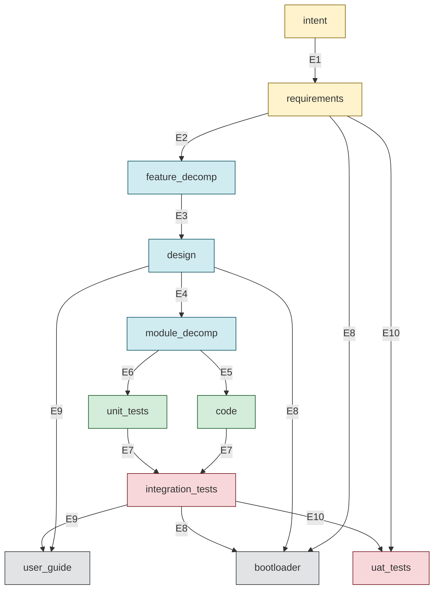

# STRATEGY: SDLC Graph Topology Redesign — Complete Specification

**Author**: Claude
**Date**: 2026-03-23T04:00:00+11:00
**Supersedes**: `20260323T020000_STRATEGY_dag-topology-and-priority-methodology.md` (initial proposal), `20260323T030000_STRATEGY_sdlc-methodology-synthesis.md` (synthesis)
**Builds on**: Plan `fuzzy-fluttering-squid.md` (bootloader as compiled constraint surface)
**For**: Jim + Codex review
**Status**: SPECIFICATION — review before implementation

---

## 1. Problem

The current SDLC graph conflates three distinct relationship types into a single linear edge chain:

```
intent → requirements → feature_decomp → design → module_decomp → code ↔ unit_tests
    → integration_tests → user_guide → uat_tests
```

This is a pipeline masquerading as a DAG. Specifically:

1. **Artifact lineage** (what is this asset intellectually derived from?) is tangled with **evidence prerequisites** (what must be proven before this asset can be accepted?)
2. **Intermediate planning assets** (feature_decomp, module_decomp) produce unstructured output — no dependency ordering, no build schedule, no priority strategy, no acceptance surface definition
3. **The bootloader** is a derived document treated as a primary source — it goes stale when spec/standards/design change, and no F_D check catches drift
4. **Three edges** encode a conveyor belt where real-world dependencies are a DAG

---

## 2. Three Relationship Types

Every connection between assets expresses one or more of these concerns. The redesign makes each explicit.

### 2a. Artifact Lineage

**What**: Asset B is intellectually derived from Asset A. B could not be created without A's content as creative input.

**Where it lives**: `Asset.lineage` field (already exists in GTL).

**Example**: `user_guide.lineage = [design]` — the guide documents what was designed. Integration tests don't contribute content to the guide; they prove the content is accurate.

### 2b. Evidence Prerequisites

**What**: Asset B cannot be *accepted* until Asset A's evaluators pass. A doesn't provide creative content to B — it provides confidence that B is built on stable ground.

**Where it lives**: Multi-source `Edge.source` (already supported by GTL — `source: Asset | list[Asset]`). All sources must converge before the edge fires.

**Example**: The edge `[code, unit_tests] → integration_tests` means: unit_tests must converge (evidence that code is correct at the unit level) before you install code into a sandbox. Unit tests don't provide creative input to integration tests — they provide a gate.

### 2c. Three distinct ordering concepts

The graph involves three ordering concepts that must not be conflated:

**Asset topological order**: The partial order implied by the edge DAG. If E7 targets `integration_tests` and E9 reads `integration_tests` as a source, then E7 must complete before E9 fires. This is structural — it falls out from the edge definitions and cannot be overridden.

**Feature traversal order**: The order in which features are processed through the graph. Determined by the build schedule (`build_schedule.json`) and priority strategy. A steel_thread strategy processes a different feature first than a risk_first strategy. Same graph, different traversal. **Engine support for schedule-aware traversal does not yet exist** — V1 processes features in discovery order. The schedule is still valuable as a planning artifact and F_H review input.

**Engine execution order**: Within a single feature traversal, the engine processes edges in topological order, running F_D→F_P→F_H per edge. This is the `iterate()` loop. The evaluator chain ordering (F_D before F_P before F_H) is a separate invariant from the edge ordering.

**Where they live**:
- Asset topological order: implicit in `Edge.source` / `Edge.target`
- Feature traversal order: `build_schedule.json` (consumed by engine when supported)
- Engine execution order: ABG engine internals (`iterate()`, `bind_fd()`)

### Why this separation matters

Without it, every question about "what should this edge's source be?" devolves into "what comes before this in the pipeline?" — which is the wrong question. The right questions are:

- What is the **creative input** to this asset? (lineage)
- What must **converge first** as evidence? (prerequisites)
- What **partial order** does this imply for edges? (asset topological order)
- What **traversal order** should features follow? (build schedule — separate concern)

---

## 3. Proposed Topology

### 3a. ASCII DAG



**Key relationships:**
- E5 + E6: module_decomp fans out to code and unit_tests in parallel (sibling derivations)
- E7: [code, unit_tests] → integration_tests — consistency proven here (tests_pass + sandbox)
- E8, E9, E10: three terminal syntheses from overlapping context — no dependencies between them
- bootloader and user_guide are leaf nodes (no downstream dependents)

### 3b. Edge Table

11 assets. 10 edges. Four edges are multi-source.

| # | Name | Source(s) | Target | Creative input | Evidence gate | Evaluators |
|---|------|----------|--------|---------------|--------------|------------|
| E1 | intent→requirements | intent | requirements | intent | — | F_H: intent approved |
| E2 | requirements→feature_decomp | requirements | feature_decomp | requirements | — | F_D: req coverage, DAG acyclic, schedule valid. F_P: decompose + schedule. F_H: approve |
| E3 | feature_decomp→design | feature_decomp | design | feature_decomp | — | F_P: ADRs cover features. F_H: approve design |
| E4 | design→module_decomp | design | module_decomp | design | — | F_D: module coverage, DAG acyclic. F_P: decompose. F_H: approve schedule |
| **E5** | **module_decomp→code** | **module_decomp** | **code** | **module_decomp** | — | F_D: impl tags. F_P: code complete |
| **E6** | **module_decomp→unit_tests** | **module_decomp** | **unit_tests** | **module_decomp** | — | F_D: validates tags. F_P: tests cover module contracts |
| **E7** | **[code, unit_tests]→integration_tests** | **[code, unit_tests]** | **integration_tests** | **code** | **unit_tests** | F_D: tests pass, sandbox report. F_P: sandbox run |
| **E8** | **[requirements, design, integration_tests]→bootloader** | **[requirements, design, integration_tests]** | **bootloader** | **requirements + design** | **integration_tests** | F_D: spec hash, version, section coverage, refs valid. F_P: regenerate. F_H: approve |
| **E9** | **[design, integration_tests]→user_guide** | **[design, integration_tests]** | **user_guide** | **design** | **integration_tests** | F_D: version, req coverage. F_P: content. F_H: approve |
| **E10** | **[requirements, integration_tests]→uat_tests** | **[requirements, integration_tests]** | **uat_tests** | **requirements** | **integration_tests** | F_H: human accepts |

**Bold** = changed from current graph.

**E6 change — TDD co-evolve removed**: The old `code↔unit_tests` reflexive edge imported a pair-programming work practice into the type system. Tests are a behavioral specification derived from module design, not a co-product of coding. Code and tests are now **parallel derivations** from `module_decomp` (E5 and E6). Consistency between them is enforced by F_D gates at E7 (`tests_pass`, `validates_tags`). TDD red-green-refactor discipline remains valid as process guidance in operating standards, but it is not a graph topology concern. The graph is now a clean DAG with no reflexive edges.

### 3c. What changed and why

| Edge | Was | Now | Reason |
|------|-----|-----|--------|
| E5 | `module_decomp → code` | `module_decomp → code` | Unchanged — code derives from module structure |
| E6 | `code ↔ unit_tests` (co-evolve) | `module_decomp → unit_tests` | Tests are a behavioral specification derived from module design, not a co-product of coding. TDD discipline is process guidance, not topology. |
| E7 | `unit_tests → integration_tests` | `[code, unit_tests] → integration_tests` | Code and tests are parallel derivations from module_decomp. Consistency (tests_pass, tags) proven here. |
| E8 | (new) | `[requirements, design, integration_tests] → bootloader` | Bootloader is a derived document. Making it a graph asset means F_D catches staleness. |
| E9 | `integration_tests → user_guide` | `[design, integration_tests] → user_guide` | Guide documents the **design**, verified by integration **proof**. |
| E10 | `user_guide → uat_tests` | `[requirements, integration_tests] → uat_tests` | UAT accepts against **requirements** with **sandbox proof**. User guide is a parallel synthesis, not a prerequisite. |

### 3d. Asset lineage changes

| Asset | Was | Now | Reason |
|-------|-----|-----|--------|
| unit_tests | `[code]` | `[module_decomp]` | Tests derive from module design (behavioral contracts), not from code |
| integration_tests | `[unit_tests]` | `[code]` | Derived from code (what gets installed), not from the test suite |
| bootloader | (new) | `[requirements, design]` | Intellectually derived from spec and design |
| user_guide | `[integration_tests]` | `[design]` | Documents the design, not the test results |
| uat_tests | `[user_guide]` | `[requirements]` | Accepts against the spec — user guide is a parallel synthesis, not a prerequisite |

---

## 4. New Asset: Bootloader

```
bootloader
  ID format: BOOT-{SEQ}
  Lineage: [requirements, design]
  Markov: [spec_hash_current, version_current, section_coverage_complete, references_valid]
  Operative: OPERATIVE_ON_APPROVED
```

### What the bootloader IS

A **compiled constraint surface** for LLM consumption. ~150-200 lines. Synthesized from three authored planes:

| Source plane | Location (source repo) | Location (installed) |
|-------------|----------------------|---------------------|
| Specification | `specification/` (INTENT, requirements, feature_decomp) | `specification/` |
| Standards | `specification/standards/` | `.gsdlc/release/operating-standards/` |
| Design | `builds/python/design/adrs/` | `design/adrs/` |

### F_D evaluators for bootloader currency

All computable without LLM:

1. **spec_hash_current**: Hash of `Package.requirements` matches hash embedded in bootloader header
2. **version_current**: Bootloader version matches `active-workflow.json` version
3. **section_coverage_complete**: Every mandatory section (1-8) present in bootloader
4. **references_valid**: Every `workspace://` path in bootloader points to an existing file

### When does E8 fire?

After `integration_tests` converges (the system works) and `design` is stable. The bootloader is one of the last things updated before UAT — same tier as user_guide.

### F_P for bootloader

Agent regenerates the bootloader from source documents. The structure is fixed (8 sections), the content is synthesized:

1. This Project — from `specification/INTENT.md`
2. Graph Topology — from `sdlc_graph.py` / `specification/feature_decomposition.md`
3. Territory Model — from ADR-008
4. Evaluator Chain — from ADR-009, ADR-010
5. Traceability Thread — from ADR-003, `specification/requirements.md`
6. Commands — from ADR-009
7. Operating Protocol — from `specification/standards/CONVENTIONS.md`, `SPEC.md`
8. Invariants — from GTL core + SDLC-specific constraints

Each section: 2-3 lines of constraint + `workspace://` reference for depth. Compression ratio ~10:1 from source documents.

---

## 5. Strengthened Intermediate Assets

### 5a. feature_decomp — structured output

**Per-feature YAML** (`.ai-workspace/features/active/FD-NNN-{name}.yml`):

```yaml
id: FD-001
name: auth-flow
satisfies:
  - REQ-F-AUTH-001
  - REQ-F-AUTH-002
depends_on: []               # other FD-* ids
acceptance_surface:          # what F_D checks prove this feature is done
  - eval_impl_tags           # all source files tagged
  - eval_tests_pass          # unit tests green
  - eval_sandbox_report      # sandbox e2e passes
steel_thread_candidate: true # touches all architectural layers?
risk_score: 7                # 1-10, uncertainty x impact
effort: M                    # S / M / L
```

**Build schedule** (`.ai-workspace/features/build_schedule.json`):

```json
{
  "priority_strategy": "steel_thread",
  "rationale": "New architecture, unproven stack — prove E2E path first",
  "mvp_boundary": ["FD-001", "FD-003"],
  "critical_path": ["FD-001", "FD-003", "FD-005"],
  "schedule": [
    {
      "id": "FD-001",
      "depends_on": [],
      "priority_score": 9,
      "rationale": "Touches all layers — auth flow through intent to deployment",
      "critical_path": true
    },
    {
      "id": "FD-003",
      "depends_on": ["FD-001"],
      "priority_score": 7,
      "rationale": "Core storage — depends on auth for access control",
      "critical_path": true
    },
    {
      "id": "FD-002",
      "depends_on": ["FD-001"],
      "priority_score": 5,
      "rationale": "Secondary auth refinements",
      "critical_path": false
    }
  ]
}
```

### 5b. feature_decomp — updated markov conditions

```
feature_decomp
  Markov (was):  all_req_keys_covered, dependency_dag_acyclic, mvp_boundary_defined
  Markov (now):  all_req_keys_covered, dependency_dag_acyclic, mvp_boundary_defined,
                 build_schedule_defined, priority_strategy_applied
```

### 5c. feature_decomp — new F_D evaluators

| Evaluator | Type | What it checks |
|-----------|------|---------------|
| `req_coverage` | F_D | Every REQ key in ≥1 feature (existing) |
| `feature_dag_acyclic` | F_D | `depends_on` fields form an acyclic graph |
| `build_schedule_exists` | F_D | `build_schedule.json` exists, is valid JSON, has required fields |
| `schedule_respects_deps` | F_D | No feature appears in schedule before its dependencies |
| `strategy_recognized` | F_D | `priority_strategy` is one of the recognized set |
| `mvp_boundary_valid` | F_D | Every ID in `mvp_boundary` exists as a feature |

All computable without LLM. Pure structural checks.

### 5d. module_decomp — structured output

**Per-module YAML** (`.ai-workspace/modules/MOD-NNN-{name}.yml`):

```yaml
id: MOD-001
name: core-engine
description: Central iteration loop and event stream
implements_features:
  - FD-001
  - FD-003
dependencies: []              # other MOD-* ids
rank: 1                       # 1=leaf (no deps), higher depends on lower
interfaces:
  - "iterate(job, evaluator_fn, asset) -> (Asset, WorkingSurface)"
  - "emit(event_type, payload) -> Event"
source_files:
  - "builds/python/src/genesis_sdlc/core.py"
acceptance_surface:
  - "test_core_iterate"       # specific test names or patterns
  - "test_event_emission"
```

### 5e. module_decomp — F_D evaluators (existing, no changes needed)

| Evaluator | Type | What it checks |
|-----------|------|---------------|
| `module_coverage` | F_D | Every feature assigned to ≥1 module (existing) |
| `module_dag_acyclic` | markov | `dependencies` form an acyclic graph (existing via markov condition) |
| `build_order_defined` | markov | `rank` field defines build order (existing via markov condition) |

The module_decomp evaluators are already well-specified. The YAML schema just needs to be enforced more precisely (acceptance_surface field is new).

---

## 6. Priority Strategies

### 6a. Declaration

Declared in `specification/INTENT.md` as a project-level choice. The project says "we are using strategy X because Y."

### 6b. Recognized strategies

| Strategy | First feature | Build order | When to use |
|----------|--------------|-------------|-------------|
| **steel_thread** | Touches all architectural layers | E2E proof first, then fan out | New architecture, unproven stack |
| **risk_first** | Highest uncertainty x impact | Kill unknowns early, predictable late | Complex domain, many unknowns |
| **dependency_first** | Leaf nodes (no dependencies) | Pure topological sort | Well-understood domain, clear DAG |
| **value_first** | Highest business value / effort | ROI-ordered | Product-driven, time-to-market pressure |
| **walking_skeleton** | All features at minimum depth | Architecture shape, then deepen | Large system, integration risk |

### 6c. How strategies interact with the graph

The strategy does NOT change the graph topology. All five strategies use the same 10-edge DAG. What changes is the **feature traversal order** — which feature gets iterated first through the graph.

The engine (ABG) reads `build_schedule.json` and processes features in schedule order. Each feature traverses the full graph (or the relevant subgraph for its profile). The strategy determines which feature goes first, not which edges fire.

### 6d. Validation

F_D validates that the declared strategy produced a schedule consistent with the feature dependency DAG. This is a structural check — if `steel_thread` is declared but the first feature in schedule doesn't touch all layers, that's a human judgment (F_H), not a structural violation. What F_D CAN check:

- Schedule exists and is well-formed
- Schedule respects `depends_on` ordering (no feature before its dependency)
- Strategy field is one of the recognized set
- Every feature appears in the schedule exactly once

### 6e. Engine support

Processing features in schedule order requires **ABG engine support for build schedules**. That's ABG work, not GSDLC graph work. The graph defines the schedule structure and validates it. The engine reads it and acts on it.

For V1, the engine processes features in whatever order it discovers them. The schedule is still valuable as a human-readable plan and F_H review artifact, even if the engine doesn't consume it yet.

---

## 7. Context Model

### 7a. Current contexts (problems)

The current graph has 6 contexts, 3 of which are bootloader-related:

| Context | Locator | Problem |
|---------|---------|---------|
| `gtl_bootloader` | `workspace://CLAUDE.md` | Transport compromise — CLAUDE.md has more than GTL content |
| `sdlc_bootloader` | `workspace://.gsdlc/release/SDLC_BOOTLOADER.md` | This is a derived OUTPUT, not an input to edges |
| `sdlc_spec` | `workspace://...` (varies) | Fine for self-hosting vs installed |
| `intent_doc` | `workspace://specification/INTENT.md` | Fine |
| `design_adrs` | `workspace://design/adrs/` | Fine |
| `modules_dir` | `workspace://.ai-workspace/modules/` | Fine |

### 7b. Proposed contexts

Edges should reference **source documents**, not derived summaries. Each edge gets only what it needs.

| Context | Locator | What it provides |
|---------|---------|-----------------|
| `gtl_bootloader` | `workspace://CLAUDE.md` | Universal GTL axioms (interim — transport compromise) |
| `spec_intent` | `workspace://specification/INTENT.md` | Project intent vectors |
| `spec_requirements` | `workspace://specification/requirements.md` | REQ keys and acceptance criteria |
| `spec_features` | `workspace://specification/feature_decomposition.md` | Feature DAG and build order |
| `operating_standards` | `workspace://.gsdlc/release/operating-standards/` | Writing, spec, conventions, release standards |
| `design_adrs` | `workspace://design/adrs/` | Architecture decision records |
| `features_dir` | `workspace://.ai-workspace/features/` | Feature vectors and build schedule |
| `modules_dir` | `workspace://.ai-workspace/modules/` | Module decomposition |
| `sdlc_spec` | `workspace://...` (parameterized) | The Package definition itself |

### 7c. What's removed

- **`sdlc_bootloader`** — removed as edge context. The bootloader is an OUTPUT of the iteration process, not an input. Agents read source documents directly. The bootloader serves cold-start orientation (CLAUDE.md), not as edge context.

### 7d. Context assignment per edge

| Edge | Contexts |
|------|----------|
| E1: intent→requirements | gtl_bootloader, spec_intent, sdlc_spec |
| E2: requirements→feature_decomp | gtl_bootloader, spec_intent, spec_requirements, sdlc_spec |
| E3: feature_decomp→design | gtl_bootloader, spec_intent, spec_features, sdlc_spec |
| E4: design→module_decomp | gtl_bootloader, design_adrs, features_dir, sdlc_spec |
| E5: module_decomp→code | gtl_bootloader, design_adrs, modules_dir, sdlc_spec |
| E6: module_decomp→unit_tests | gtl_bootloader, design_adrs, modules_dir, sdlc_spec |
| E7: [code,unit_tests]→integration_tests | gtl_bootloader, sdlc_spec |
| E8: [req,design,itest]→bootloader | spec_intent, spec_requirements, spec_features, operating_standards, design_adrs, sdlc_spec |
| E9: [design,itest]→user_guide | gtl_bootloader, design_adrs, operating_standards, sdlc_spec |
| E10: evidence→uat_tests | gtl_bootloader, spec_requirements, sdlc_spec |

**Principle**: Each edge gets the contexts its evaluators actually need. No edge gets everything. The bootloader edge (E8) gets the most contexts because it synthesizes across all source planes.

---

## 8. active-workflow.json Placement

### Current state

`.gsdlc/release/active-workflow.json` containing:
```json
{"version": "1.0.0b1", "profile": "standard", "workflow": "genesis_sdlc/standard/v1_0_0b1"}
```

### Status: UNRESOLVED

This is an open territory decision. Two plausible placements:

**Option A: `.gsdlc/release/` (current)** — Installer-written, read-only between releases. Treats it as a release artifact pinning the active workflow version. Evaluators read it for version checks.

**Option B: `.ai-workspace/`** — Runtime state that could change when workflows activate/deactivate. Treats it as mutable operational state.

The current placement works mechanically. The architectural question is whether this file's semantics are "release pin" or "runtime state." This does not block the topology redesign — evaluators reference it by path regardless of where it lives. But it should not be claimed as settled until the territory decision is made explicitly.

### Evaluator references (path-agnostic)

- `eval_guide_version` reads version from `active-workflow.json`
- Bootloader F_D `version_current` will also read from `active-workflow.json`

These references work at either location.

---

## 9. Open Questions and Resolved Questions

### Resolved

| Question | Resolution |
|----------|-----------|
| Size budget for compiled bootloader | ~150-200 lines. 10:1 compression from ~2,000 lines of source. Each section: 2-3 lines of constraint + workspace:// reference. |
| GTL bootloader — ABG-owned or also iterated? | ABG-owned independently. The GTL bootloader is a universal axiom set managed by ABG's own release process. GSDLC does not iterate or validate it — that's ABG's responsibility. GSDLC iterates only the SDLC bootloader (its own compiled constraint surface). |
| Priority strategies — part of this redesign or separate? | Part of this redesign. Defined here as feature_decomp structured output, validated by F_D, consumed by engine (when engine supports it). |
| Bootloader generation — template or fixed structure? | Fixed 8-section structure with F_P-generated content. The sections are invariant. The content within each section is synthesized from source documents. F_P regenerates all content; F_D validates the structure. |

### Resolved (post-Codex review)

| Question | Resolution |
|----------|-----------|
| **Bootloader: workflow-observability or product-acceptance?** | **Workflow-only. Leaf node.** Bootloader is an output of the workflow — a compiled constraint surface that the methodology produces and validates. It is NOT a source for E10 (uat_tests). Nothing depends on it. It has its own edge (E8) for currency validation. Methodology health is separate from product acceptance. |

### Still open

| Question | Options | What blocks |
|----------|---------|-------------|
| **active-workflow.json territory** | (A) `.gsdlc/release/` — release pin, installer-written. (B) `.ai-workspace/` — runtime state. | Does not block topology redesign. Evaluators reference by path regardless. |

---

## 10. Specification Impact

### 10a. REQ keys that need updating

| REQ Key | Current text | Change needed |
|---------|-------------|--------------|
| REQ-F-GRAPH-001 AC-2 | "Nine edges with the topology: ..." | Update to 10 edges with DAG topology |
| REQ-F-GRAPH-001 AC-1 | "Ten assets" | Update to 11 assets (add bootloader) |
| REQ-F-UAT-002 AC-1 | "edge `unit_tests→integration_tests`" | Update to `[code, unit_tests]→integration_tests` |
| REQ-F-DOCS-002 AC-1 | "edge `integration_tests→user_guide`" | Update to `[design, integration_tests]→user_guide` |

### 10b. New REQ keys needed

| Proposed key | What it covers |
|-------------|---------------|
| REQ-F-BOOT-007 | Bootloader is a graph asset with F_D/F_P/F_H evaluation |
| REQ-F-GRAPH-003 | Feature decomp produces build_schedule.json with priority strategy |
| REQ-F-GRAPH-004 | Build schedule validated by F_D (DAG acyclic, deps respected, strategy recognized) |

### 10c. feature_decomposition.md changes

- Add bootloader as a feature (or as part of existing REQ-F-GRAPH)
- Update dependency DAG to show bootloader's position
- Update module mapping

---

## 11. Implementation Map

### Phase 1: Specification updates (spec leads)

1. Update `specification/requirements.md` — new REQ keys, updated AC text
2. Update `specification/feature_decomposition.md` — bootloader feature, updated DAG

### Phase 2: Graph code changes

3. `builds/python/src/genesis_sdlc/sdlc_graph.py` — module scope:
   - Add `bootloader` asset
   - Add new contexts (`spec_requirements`, `spec_features`, `operating_standards`, `features_dir`)
   - Remove `sdlc_bootloader` context
   - Add bootloader evaluators (4 F_D + 1 F_P + 1 F_H)
   - Add feature_decomp evaluators (`build_schedule_exists`, `schedule_respects_deps`, `strategy_recognized`, `mvp_boundary_valid`)
   - Replace E6: `code↔unit_tests` (co-evolve) → `module_decomp→unit_tests` (tests derive from modules)
   - Move tests_pass F_D from E6 to E7
   - Change E7 source: `unit_tests` → `[code, unit_tests]`
   - Add E8: `[requirements, design, integration_tests] → bootloader`
   - Change E9 source: `integration_tests` → `[design, integration_tests]`
   - Change E10 source: `user_guide` → `[requirements, integration_tests]`
   - Remove `co_evolve=True` — no reflexive edges remain
   - Update asset lineage: unit_tests, integration_tests, user_guide, uat_tests
   - Update context assignments per edge (section 7d)
   - Update markov conditions for feature_decomp

4. `builds/python/src/genesis_sdlc/sdlc_graph.py` — `instantiate()`:
   - Mirror all module-scope changes
   - Parameterize new contexts (spec paths may differ for installed projects)
   - Parameterize bootloader evaluator commands
   - Add bootloader to package assets, edges, operators list

### Phase 3: Installer updates

5. `builds/python/src/genesis_sdlc/install.py`:
   - Bootloader generation mechanism (F_P can regenerate, but initial install needs a v0)
   - Update scaffolding if needed (`.ai-workspace/features/` already exists)

### Phase 4: Verification

6. Clean install into fresh `test_install/`
7. Verify: 11 assets, 10 edges, all context paths resolve
8. Verify: bootloader evaluators pass (spec hash, version, sections, refs)
9. Run `gen-gaps` — bootloader edge delta should be 0

---

## 12. What This Does NOT Cover

- **Engine changes for schedule-aware traversal** — ABG work, not GSDLC
- **Bootloader content generation** — the F_P prompt for synthesizing the bootloader from source docs is a separate deliverable; this spec defines what the output structure must look like and what F_D validates
- **Graph variant profiles** — ADR-012 profiles (poc, hotfix, minimal) interact with this topology but are separate work
- **Multi-agent coordination** — single worker in V1
- **CI/CD integration** — out of scope

---

## 13. Verification Criteria

The redesign is correct when:

1. `gen-gaps` on a converged workspace reports 10 edges, all delta=0
2. Changing a REQ key in `requirements.md` causes `gen-gaps` to report delta>0 on E2 (feature_decomp), E8 (bootloader), and E10 (uat_tests) — because all three reference requirements as a source
3. The bootloader F_D evaluators catch: wrong spec hash, wrong version, missing section, broken workspace:// reference
4. `build_schedule.json` F_D evaluators catch: missing schedule, unknown strategy, dep ordering violation
5. Clean install into empty target produces 11 assets, 10 edges, all context paths resolve
6. The graph renders as a clean DAG (no reflexive edges) in Mermaid output from `Package.mermaid()`

---

## Decision Requested

### Approved design (needs confirmation)

1. Three-concern separation (lineage / evidence / delivery) — agreed?
2. Edge changes E7, E9 — correct sources and rationale?
3. Bootloader as 11th asset — correct markov conditions and evaluators?
4. Feature decomp structured output (build_schedule.json, priority strategies) — correct schema and F_D validators?
5. Context model (sdlc_bootloader removed as input, source docs added) — agreed?
6. Implementation phases (spec first, then graph code, then installer, then verify) — agreed?

### Resolved decisions

7. **Bootloader and UAT**: RESOLVED — bootloader is a **leaf node**, workflow-observability only. NOT a source for E10. Nothing depends on it.

### Open decisions (not blocking)

8. **active-workflow.json**: `.gsdlc/release/` (release pin) or `.ai-workspace/` (runtime state)? Does not block topology work.
