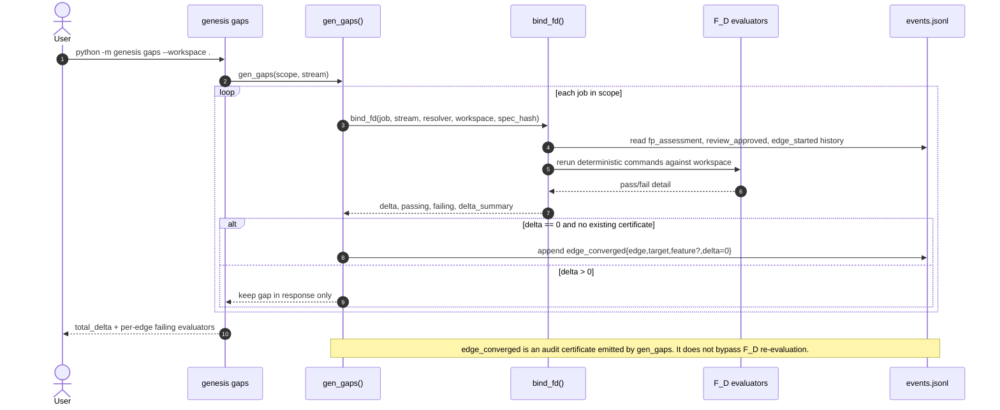
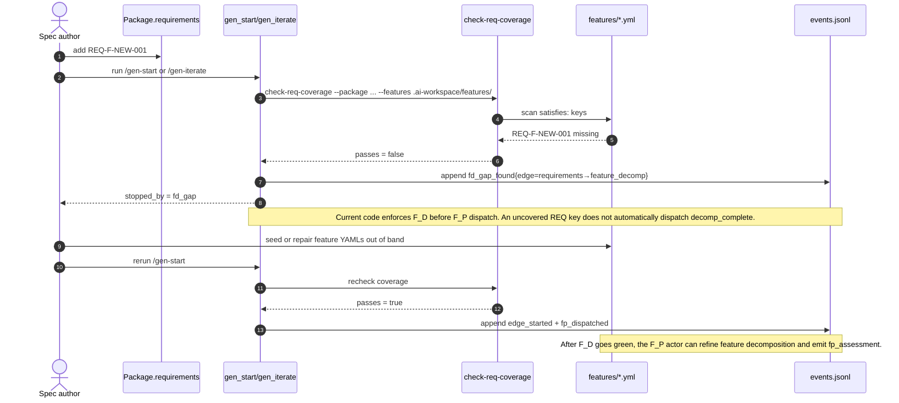
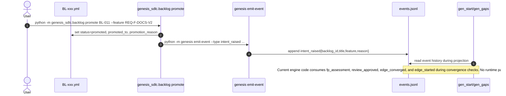

# SCHEMA: Runtime Sequence Diagrams for Intents, Gaps, and Events

**Author**: Codex
**Date**: 2026-03-19T07:59:14Z
**Addresses**: engine runtime flow; gap detection; feature emergence; backlog promotion; event storage surfaces
**For**: all

## Summary

These diagrams document current implementation reality. They show where state is stored, which functions read it, and which event types the engine actually consumes to identify gaps and convergence.

Two boundaries matter:

- `fp_assessment`, `review_approved`, and `edge_converged` participate directly in convergence
- `intent_raised` is currently emitted, but no engine path consumes it to create feature vectors automatically

## Storage Surfaces

- `.ai-workspace/events/events.jsonl` — append-only event log
- `.ai-workspace/fp_manifests/*.json` — F_P dispatch manifests written by `gen_iterate`
- `.ai-workspace/fp_results/*.json` — F_P assessment payloads written by the actor
- `.ai-workspace/features/active/*.yml` and `.ai-workspace/features/completed/*.yml` — feature vectors
- `.ai-workspace/backlog/BL-*.yml` — pre-intent backlog items
- `.ai-workspace/reviews/proxy-log/*.md` — human-proxy review audit trail

## Diagram 1 — `gen start` / `gen iterate`: how graph work advances toward code

```mermaid
sequenceDiagram
    autonumber
    actor User
    participant CLI as genesis __main__.py
    participant Config as .genesis/genesis.yml
    participant WS as workspace_bootstrap()
    participant Log as events.jsonl
    participant Start as gen_start()
    participant Bind as bind_fd()
    participant Iter as gen_iterate()/iterate()
    participant Manifest as fp_manifests/*.json
    participant Result as fp_results/*.json
    participant Actor as F_P actor
    participant Files as workspace artifacts

    User->>CLI: python -m genesis start --auto --workspace .
    CLI->>Config: load package, worker, pythonpath
    CLI->>WS: bootstrap workspace
    WS->>Log: ensure .ai-workspace/events/events.jsonl exists
    CLI->>Start: gen_start(scope, stream, auto=True)

    loop topological job scan
        Start->>Bind: bind_fd(job, stream, resolver, workspace, spec_hash)
        Bind->>Log: read all_events() + project(current)
        Bind->>Files: run F_D evaluator commands
    end

    alt selected job has only F_P gap
        Start->>Iter: gen_iterate(selected_job)
        Iter->>Log: append edge_started{edge,target}
        Iter->>Manifest: write dispatch manifest
        Iter->>Log: append fp_dispatched{edge,failing_evaluators}
        CLI-->>User: exit 2 + fp_manifest_path
        User->>Actor: dispatch prompt from manifest
        Actor->>Files: write target artifact(s)
        Actor->>Result: write assessment JSON
        User->>CLI: python -m genesis emit-event --type fp_assessment ...
        CLI->>Log: append fp_assessment{edge,evaluator,result,spec_hash}
        Note over Start,Files: The next /gen-start or /gen-gaps re-runs bind_fd against the updated files and event log.
    else selected job has only F_H gap
        Start->>Iter: gen_iterate(selected_job)
        Iter->>Log: append edge_started{edge,target}
        Iter->>Log: append fh_gate_pending{edge,criteria}
        CLI-->>User: exit 3 + gate criteria
        User->>CLI: python -m genesis emit-event --type review_approved ...
        CLI->>Log: append review_approved{edge,actor}
    else selected job still has F_D gap
        Start->>Iter: gen_iterate(selected_job)
        Iter->>Log: append fd_gap_found{edge,failing,delta_summary}
        CLI-->>User: exit 4 + failing evaluators
    end
```

## Diagram 2 — `gen gaps`: where gaps are identified and convergence is certified



## Diagram 3 — requirements coverage gap: how a missing feature is detected today



## Diagram 4 — backlog promotion: how a need enters the event log as intent



## Recommended Action

1. Use these diagrams as the current-state baseline while BOOT-V2 is being implemented.
2. Decide whether the desired future flow is `gap_detected -> intent_raised -> feature_vector_created` or `gap_detected -> feature_vector_created` directly.
3. If the intent path is desired, add a concrete engine or skill consumer for `intent_raised`; today it is emit-only.
4. If automatic feature creation from uncovered REQ keys is desired, the `requirements→feature_decomp` edge needs a mechanism that can act while `req_coverage` is red.
