# ABG Design Document

**Author**: Codex  
**Date**: 2026-03-24  
**Purpose**: Human review document for the current abiogenesis constitutional design  
**Scope**: Requirements and accepted design implementations for the active ABG model  
**Primary source repos**: [abiogenesis](/Users/jim/src/apps/abiogenesis), [genesis_sdlc](/Users/jim/src/apps/genesis_sdlc)  

## 1. Review Scope

This document consolidates the current ABG model from:

- `INT-001` through `INT-005`
- the active requirement families under `specification/requirements/`
- accepted ADRs, especially `ADR-016`, `ADR-023` through `ADR-029`

It is written for human review, not for the engine. The goal is to show:

1. the domain models
2. the main engine sequencing
3. the important subflows
4. the major algorithmic choices
5. how the requirement families map to the design

## 2. Constitutional Map

| Concern | Requirement families | Design owner |
|---|---|---|
| GTL package, graph, assets | `GRAPH`, `BOOTDOC`, parts of `CORE` | `ADR-001`, `ADR-025`, `ADR-028` |
| Event calculus and convergence truth | `EC`, parts of `EVAL` | `ADR-016` |
| Work identity and traversal | `WK`, `TRAV`, parts of `CMD`, `VIS` | `ADR-023`, `ADR-024`, `ADR-013` |
| Recursive composition and refinement | `FRAG`, `COMP`, `REFINE` | `ADR-025` |
| Correction semantics | `CORRECT` | `ADR-026` |
| Run governance and leaf tasks | `RUN`, `LEAF` | `ADR-027` |
| Workflow provenance | `PROV` | `ADR-029` |
| Bootstrap/install/runtime substrate | `BOOT`, `WKSP`, parts of `CMD`, parts of `CORE` | `ADR-005`, `ADR-006`, `ADR-007`, `ADR-018` |
| Deterministic bind/manifest surfaces | `BIND`, parts of `CORE`, parts of `CMD` | `ADR-002`, `ADR-003` |
| Snapshot-bound F_P and coverage evaluators | parts of `EVAL` | `ADR-011`, `ADR-012` |

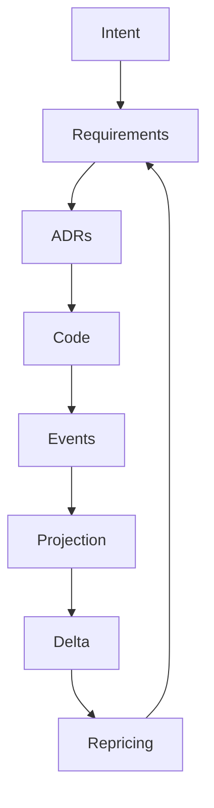

## 3. Domain Models

ABG has several orthogonal but connected domain models.

## 3.1 GTL Topology Model

This is the constitutional graph language: assets, edges, evaluators, operators, jobs, workers, packages, fragments.

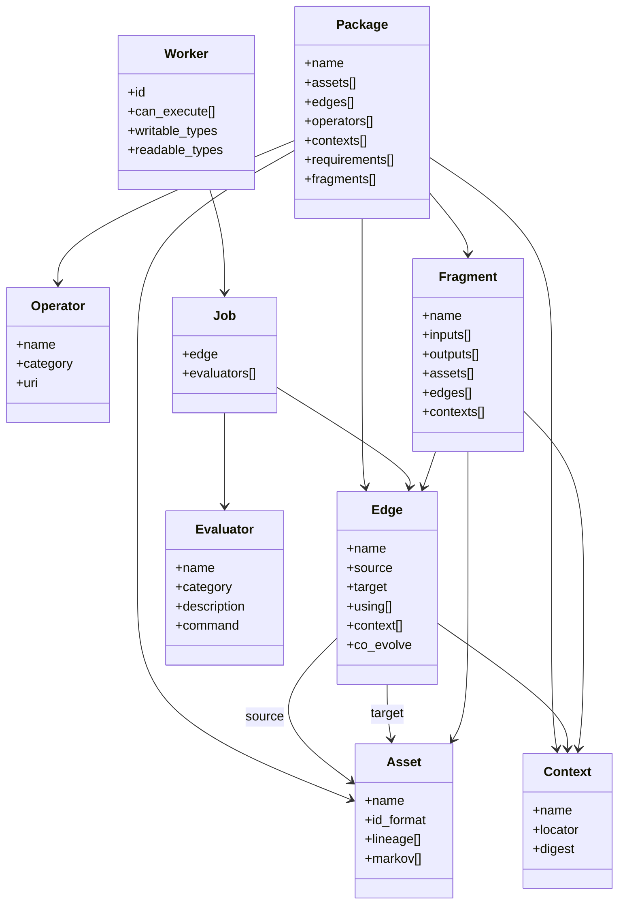

**Key design choices**

- `Package` is the bounded constitutional world.
- `Job` is the typed transform unit over an edge.
- `Fragment` is the reusable subgraph unit.
- `Graph functions` are named graph-valued functions that return `Fragment`s.
- The base authored graph is stable; fragments and zoom extend it lawfully.

## 3.2 Work and Dispatch Model

This is the V2 routing layer above the GTL topology.

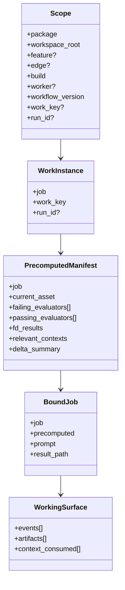

**Key design choices**

- `work_key` is immutable work identity.
- `run_id` is attempt identity.
- `WorkInstance(job, work_key, run_id)` is the real unit of traversal.
- `bind_fd()` computes deterministic state before agent/human involvement.
- `bind_fp()` assembles the F_P manifest; it does not compute convergence.

## 3.3 Event, Projection, and Event Calculus Model

This is the truth substrate.

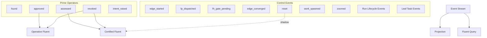

**Key design choices**

- The event stream is append-only.
- Only the five prime operators participate in fluent truth.
- F_H and F_P are queried by fluent projection.
- F_D is always live execution, not a fluent.
- `reset` shadows F_P certification without terminating fluents.
- V1 compatibility survives only as explicit degenerate cases and replay shims.

## 3.4 Provenance Model

This is the version-binding layer over events and convergence.

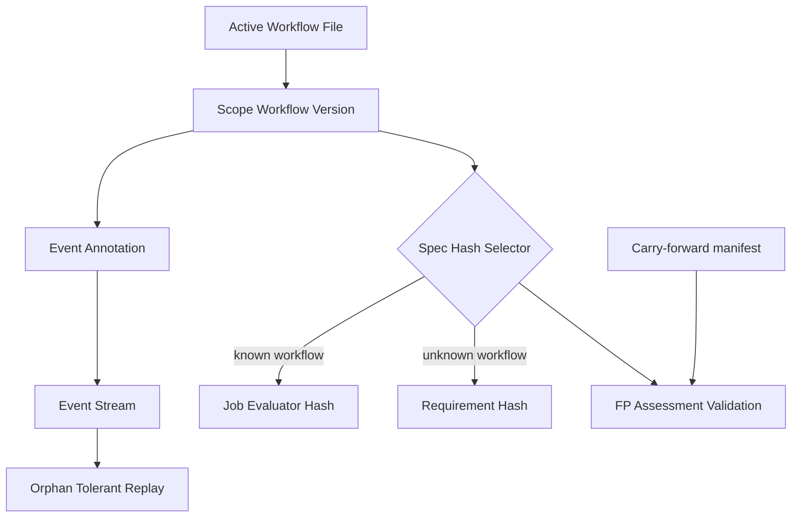

**Key design choices**

- `active-workflow.json` is the single source of workflow version truth.
- `workflow_version` is injected into events when known.
- `job_evaluator_hash(job)` is the primary spec identity under provenance.
- `req_hash(requirements)` is the degenerate fallback.
- carry-forward is explicit and manifest-driven, not automatic.
- orphan events are tolerated to allow graph evolution.

## 3.5 Recursive Composition and Refinement Model

This is the V2 graph evolution model.

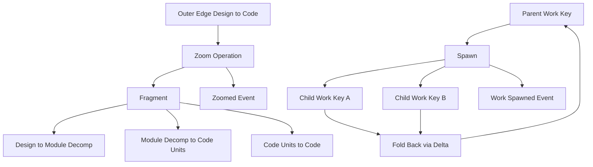

**Key design choices**

- `zoom` expands one coarse edge into a fragment while preserving the outer contract.
- `work_spawned` captures child lineage in the event stream.
- parent convergence is fold-back over descendants.
- refinement is replayable entirely from the event log.

## 3.6 Run Governance and Leaf Task Model

This is the execution-control model for attempts and bounded sub-work.

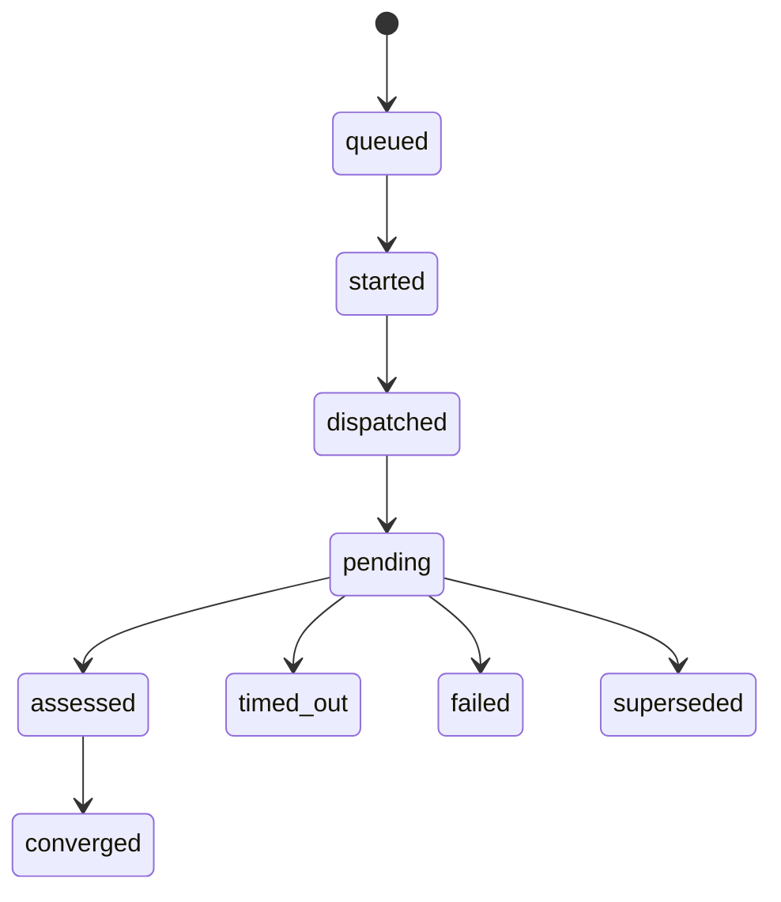

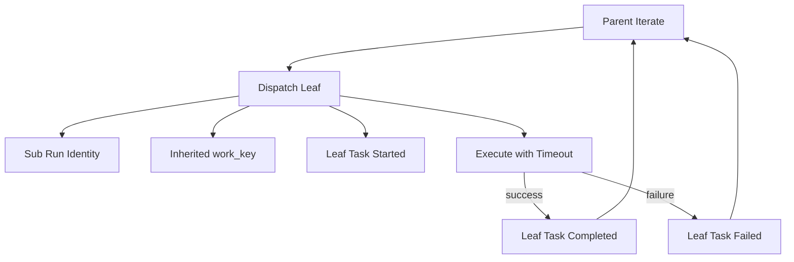

**Key design choices**

- one run = one attempt on one `work_key`
- run lifecycle is event-sourced
- failures are typed: `transport_failure`, `no_output`, `bad_output`, `certification_failure`
- supersession is explicit via `run_superseded`
- leaf tasks are subordinate sub-work, not independent graph edges

## 3.7 Bootloader Artifact Model

This is the ABG-local bootloader-as-asset model.

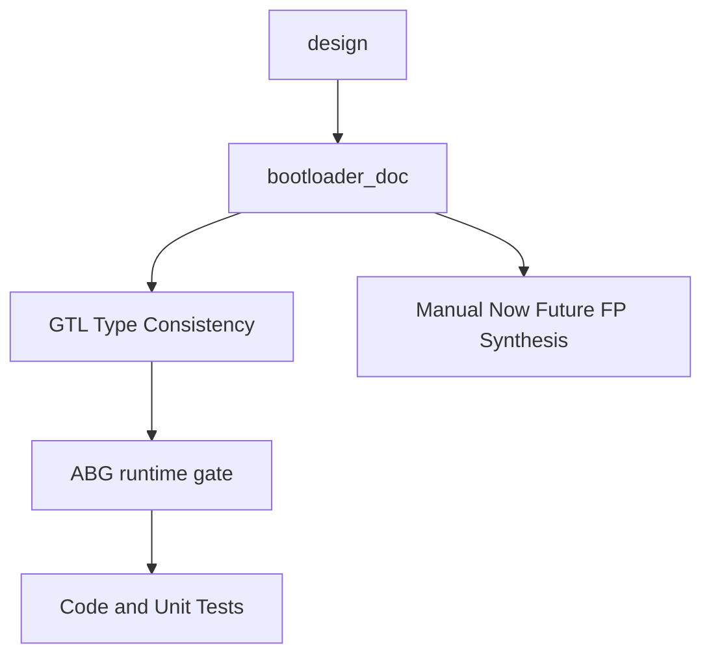

**Key design choices**

- `bootloader_doc` is a graph asset with design lineage.
- `gtl_type_consistency` is the deterministic guard.
- current reality is bootstrap/manual authoring.
- future direction is derivation/synthesis, but that is not the current capability claim.

## 4. Main Engine Sequencing

## 4.1 Main Engine Flow

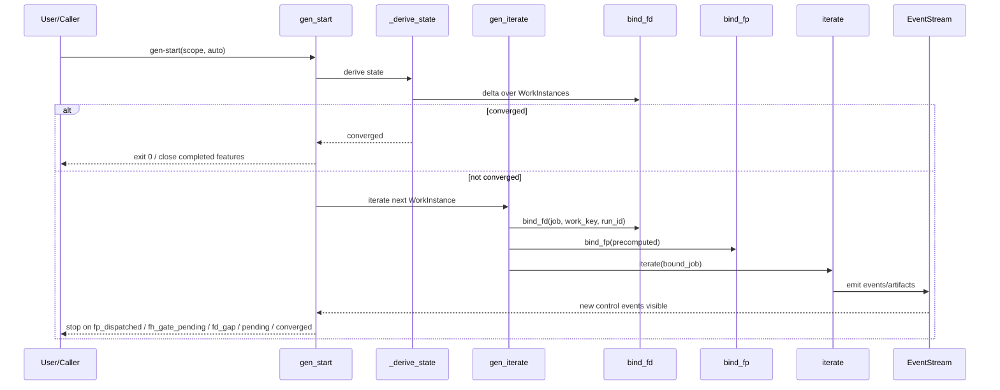

## 4.2 Convergence and Escalation Flow

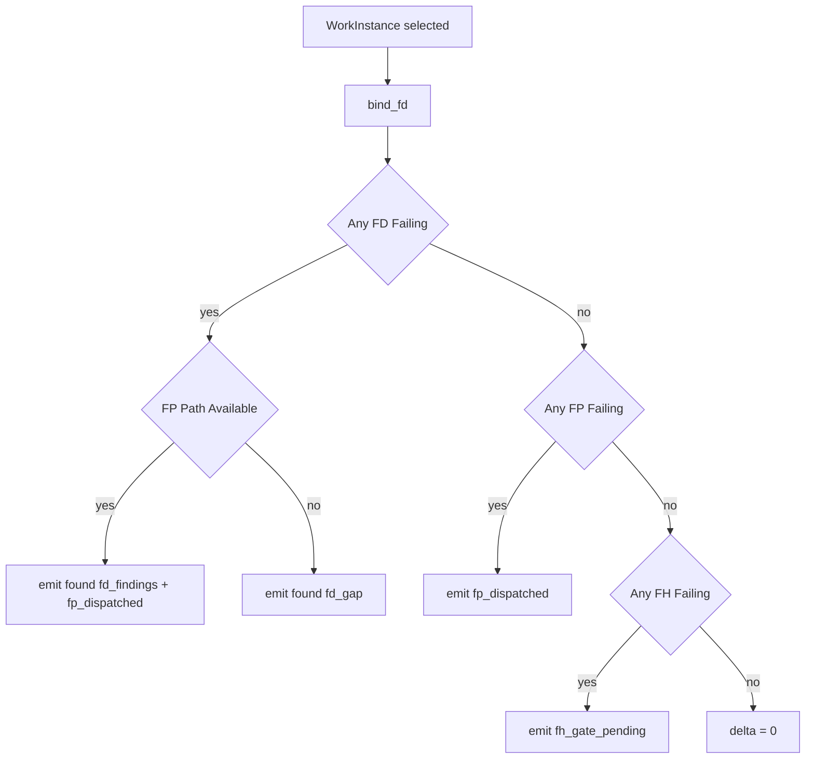

**Why this ordering**

- F_D is cheapest and most authoritative.
- F_P is construction under bounded ambiguity.
- F_H is reserved for residual human judgment.

## 4.3 WorkInstance Scheduling Flow

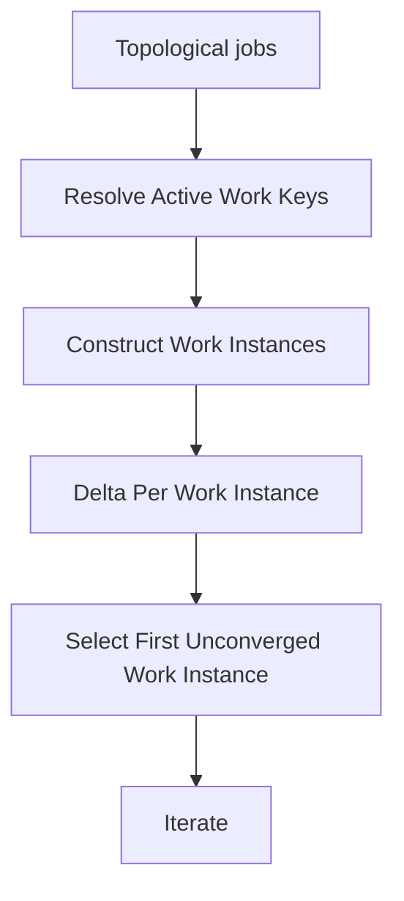

**Scheduling rule**

- job order is topological
- within an edge, work keys are routed separately
- child work may affect parent convergence by fold-back
- worker batching is separate from work scheduling

## 4.4 Feature Completion Flow

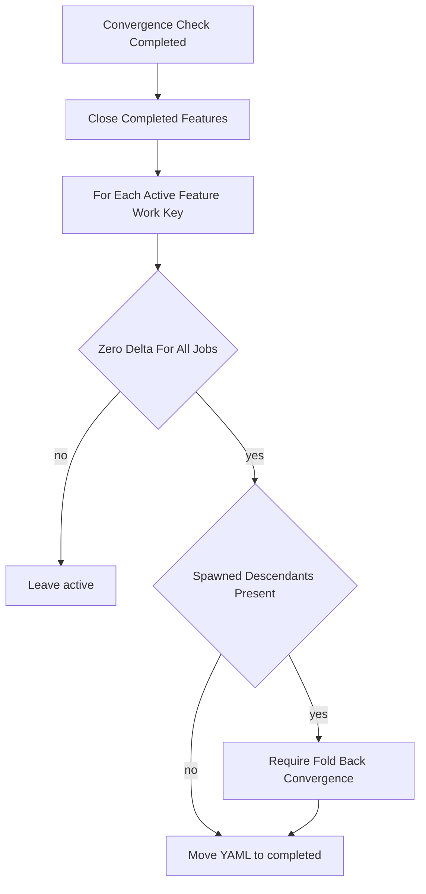

## 5. Important Subflows

## 5.1 Correction and Reset

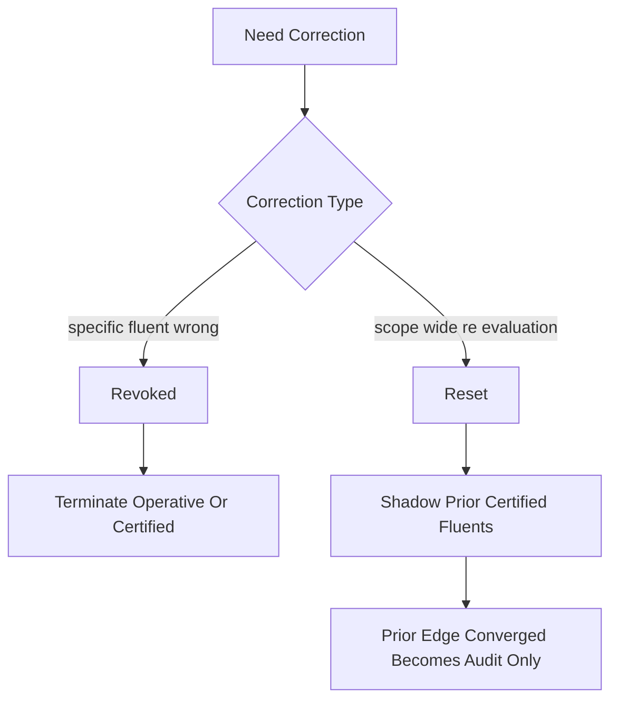

**Design rule**

- `revoked` is semantic compensation
- `reset` is certification-boundary control
- both are append-only and replayable

## 5.2 Provenance and Carry-Forward

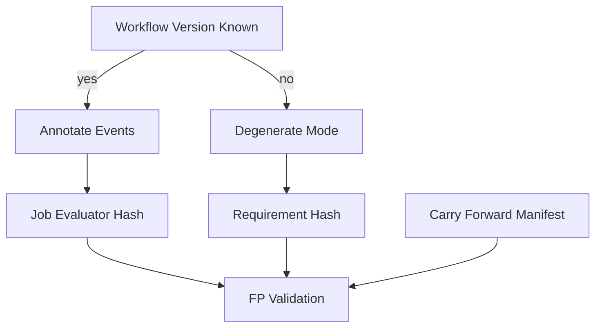

## 5.3 Run Supersession

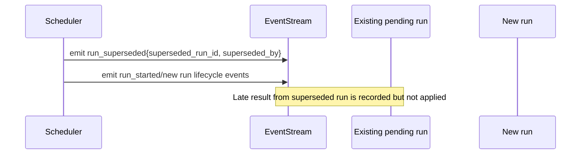

## 5.4 Bootloader Consistency

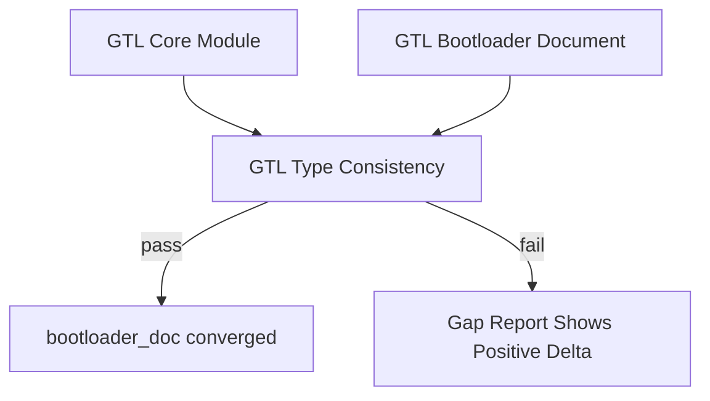

## 6. Algorithmic Choices

## 6.1 Delta

```text
delta(job, stream, workspace_root, spec_hash, workflow_version, carry_forward, work_key)
```

**Rule**

- F_D = live execution
- F_H = `holdsAt(operative(...))`
- F_P = `holdsAt(certified(...))`
- result is normalized failure fraction in `[0.0, 1.0]`

**V2 extension**

- if the `work_key` has spawned descendants, convergence delegates through fold-back

## 6.2 Projection

```text
project(stream, asset_type, instance_id_or_work_key)
```

**Rule**

- projection is deterministic
- same stream + same query = same result
- no hidden mutable state is allowed in state derivation

## 6.3 Spec Hash

```text
if workflow_version == "unknown":
    spec_hash = req_hash(requirements)
else:
    spec_hash = job_evaluator_hash(job)
```

**Why**

- `req_hash` preserves degenerate V1 behavior
- `job_evaluator_hash` gives evaluator-level invalidation under provenance

## 6.4 Reset Boundary

```text
latest applicable reset = most recent reset whose scope contains the query
certified(...) holds only if initiating assessed(pass) is after that boundary
```

**What reset does not do**

- does not terminate fluents
- does not erase events
- does not reopen F_H approval

## 6.5 Fold-Back

```text
parent converged only when all descendant work_keys are converged
```

**Why**

- recursive refinement must collapse back to parent truth
- children are discovered from `work_spawned`, not hidden scheduler state

## 6.6 Pending and Retry

```text
at most one dispatched/pending run per (work_key, edge)
transport failures retry with bounded backoff
late superseded results are recorded but not applied
```

## 7. Review Focus

For a human design review, the highest-value questions are:

1. Is `WorkInstance` now truly the unit of traversal everywhere that matters?
2. Does the event model cleanly separate prime truth from control/lifecycle bookkeeping?
3. Is `reset` semantically distinct from compensation in both spec and runtime?
4. Is recursive refinement lawful and replayable, or still partly helper-driven?
5. Does run governance stay subordinate to convergence truth rather than becoming a second engine?
6. Is bootloader handling honestly scoped as ABG-local and bootstrap-realistic?

## 8. Current Design Thesis

ABG is an event-sourced convergence engine over a typed GTL graph.

Its V2 direction is:

- routed work identity
- recursive compositional refinement
- event-calculus truth
- provenance-bound certification
- explicit run governance
- bounded subordinate leaf work

The kernel stays small. Complexity is pushed into lawful structure rather than ad hoc imperative exceptions.
