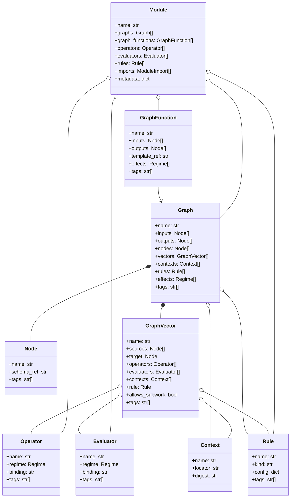
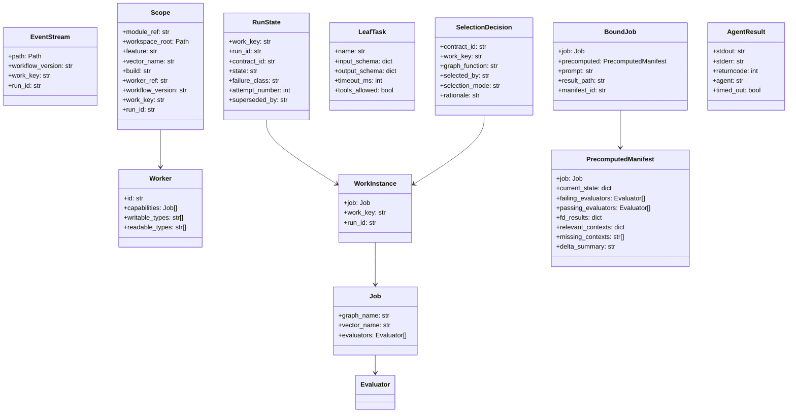
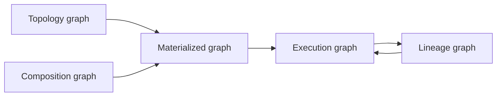
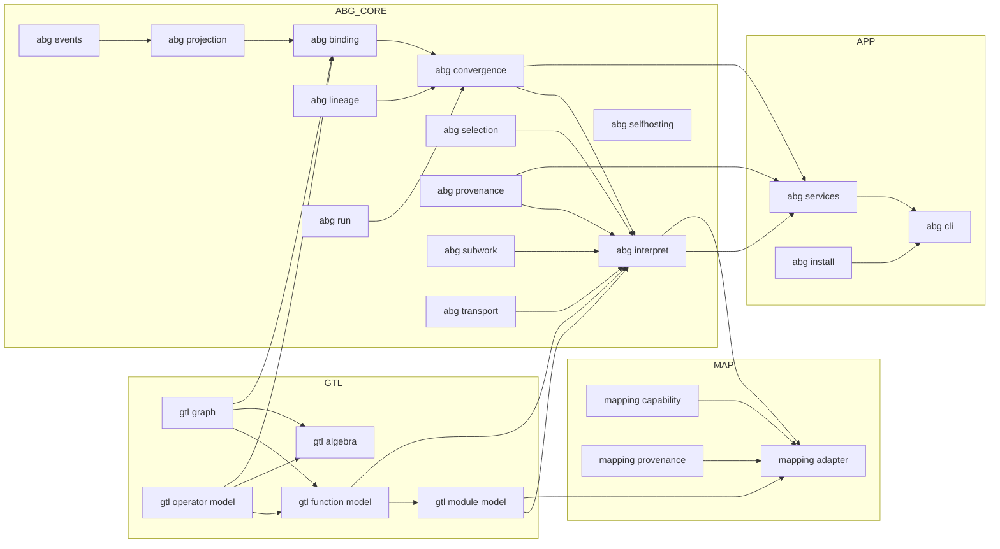

# GTL 2.x / ABG Module Design

**Status**: Draft review artifact
**Date**: 2026-03-24
**Purpose**: Define the module-level design that sits between the GTL 2.x constitutional documents and the implementation code. This document translates constitutional law into concrete module boundaries, detailed domain model, dependency rules, and a current-to-target decomposition plan.

**Derived from**:
- [GTL_2_CONSTITUTIONAL_DESIGN.md](/Users/jim/src/apps/abiogenesis/specification/GTL_2_CONSTITUTIONAL_DESIGN.md)
- [GTL_2_ABG_CONTRACT.md](/Users/jim/src/apps/abiogenesis/specification/GTL_2_ABG_CONTRACT.md)
- `/Users/jim/src/apps/abiogenesis/specification/requirements`
- [ADR-022-subprocess-transport-with-env-sanitization.md](/Users/jim/src/apps/abiogenesis/builds/claude_code/design/adrs/ADR-022-subprocess-transport-with-env-sanitization.md)
- current implementation modules under `/Users/jim/src/apps/abiogenesis/builds/claude_code/code`

---

## 1. Position

This document is the intermediate step between design and code.

It does not create new constitutional law.

It answers a different question:

- given the GTL 2.x constitution and the ABG target engine contract,
- what are the concrete module boundaries,
- what are the detailed types,
- and how should the current mixed codebase be decomposed?

The design stance is:

- `Graph` is the one public structural type
- `Node` is the typed local graph locus
- `GraphVector` is an internal graph constituent used to represent adjacency and schedulable contract steps
- GTL owns structure and graph algebra
- ABG owns interpretation, execution, replay, lineage, convergence, and provenance
- interfaces and app surfaces sit outside the kernel

---

## 2. Design Rules

1. GTL modules must not import ABG modules.
2. ABG core may import GTL declarations, but GTL may not depend on ABG runtime types.
3. Product policy and CLI behavior must not leak into GTL core modules.
4. Transport is replaceable behind an ABG runtime boundary.
5. `Graph` is public ontology; `GraphVector` is implementation structure.
6. `Job`, `Worker`, `RunState`, `WorkInstance`, and `LeafTask` are ABG runtime types, not GTL language types.
7. Provenance recording is an engine obligation even when the language requires provenance-carrying structure.
8. Higher-order operations belong to GTL semantics, but their realization belongs to ABG.

---

## 3. Detailed Domain Model

### 3.1 GTL public domain model

### 3.2 Notes on the GTL model

- `Graph` is the public first-class value.
- `GraphVector` is not a rival public ontology. It is the internal relation record that makes graph adjacency explicit in code.
- `edge(a, b, ...) -> Graph` may remain as DSL sugar for constructing a one-vector graph.
- `Vector[T]` is not a module. It is a node schema pattern represented as `Node` schema metadata.
- `GraphFunction` is the reusable authoring surface that materializes graphs.
- `Module` is the publication and import boundary.

### 3.3 ABG runtime model

### 3.4 Layered graph view in module terms

Meaning:

- GTL modules own topology and composition.
- GTL/ABG boundary owns materialization.
- ABG modules own execution and lineage.

---

## 4. Target Module Stack

### 4.1 GTL language layer

| Target module | Owns | Primary types / functions | Requirement families |
| --- | --- | --- | --- |
| `gtl.graph` | graph structure | `Graph`, `Node`, `GraphVector`, `Context` | `REQ-L-GTL2-GRAPH`, `REQ-L-GTL2-NODE`, `REQ-L-GTL2-INTERFACE` |
| `gtl.operator_model` | effect and convergence declarations | `Operator`, `Evaluator`, `Rule`, `Consensus` | `REQ-L-GTL2-OPERATOR`, `REQ-L-GTL2-EVALUATOR`, `REQ-L-GTL2-RULE` |
| `gtl.function_model` | reusable workflow programs | `GraphFunction`, `GraphTemplate` | `REQ-L-GTL2-GRAPHFUNCTION` |
| `gtl.algebra` | graph algebra | `compose`, `substitute`, `recurse`, `fan_out`, `fan_in`, `gate`, `promote` | `REQ-L-GTL2-COMPOSE`, `REQ-L-GTL2-SUBSTITUTE`, `REQ-L-GTL2-RECURSE`, `REQ-L-GTL2-HOF`, `REQ-L-GTL2-LAWS` |
| `gtl.module_model` | publication and imports | `Module`, `ModuleImport`, library metadata | `REQ-L-GTL2-MODULE`, `REQ-L-GTL2-SELECTION-BOUNDARY`, `REQ-L-GTL2-ENGINE-INDEPENDENCE` |

### 4.2 ABG engine kernel

| Target module | Owns | Primary types / functions | Requirement families |
| --- | --- | --- | --- |
| `abg.events` | append-only event substrate | `EventStream`, `emit`, event schema helpers | `REQ-R-ABG2-EVENTS` |
| `abg.projection` | pure replay | `project`, derived truth folds | `REQ-R-ABG2-PROJECTION` |
| `abg.binding` | deterministic precomputation | `PrecomputedManifest`, `BoundJob`, `bind_fd`, `bind_fp`, `bind_fh`, spec hashes | `REQ-R-ABG2-INTERPRET`, `REQ-R-ABG2-PROVENANCE` |
| `abg.lineage` | work identity and parent/child relationships | `WorkInstance`, `spawn`, `fold_back`, lineage queries | `REQ-R-ABG2-LINEAGE` |
| `abg.run` | execution attempts | `RunState`, `find_pending_run`, `supersede_run` | `REQ-R-ABG2-RUN` |
| `abg.convergence` | delta and convergence | `delta`, convergence visibility, completion checks | `REQ-R-ABG2-CONVERGENCE` |
| `abg.selection` | candidate enumeration and application | candidate discovery, selection validation, `SelectionDecision` | `REQ-R-ABG2-SELECTION-APPLICATION` |
| `abg.provenance` | spec, workflow, selection, substitution provenance | workflow version reads, carry-forward, provenance event helpers | `REQ-R-ABG2-PROVENANCE` |
| `abg.subwork` | bounded sub-work realization | `LeafTask`, schema validation, sub-run helpers | `REQ-R-ABG2-LEAFTASK` |
| `abg.transport` | agent transport surface | `AgentResult`, `AgentTransportError`, `dispatch_agent`, `dispatch_leaf` | ADR-022, `REQ-R-ABG2-RUN`, `REQ-R-ABG2-LEAFTASK` |
| `abg.interpret` | graph interpretation loop | graph materialization, graph traversal, next action, selection application, substitution orchestration | `REQ-R-ABG2-INTERPRET` |
| `abg.selfhosting` | derived artifact governance | bootloader and derived artifact checks | `REQ-R-ABG2-SELFHOSTING` |

### 4.3 ABG application surface

| Target module | Owns | Primary types / functions | Notes |
| --- | --- | --- | --- |
| `abg.services` | named app services | `Scope`, `gen_gaps`, `gen_iterate`, `gen_start` | orchestrates kernel modules, not part of GTL |
| `abg.cli` | CLI adapter | parser, CLI command wiring | implementation surface only |
| `abg.install` | bootstrap/install tooling | installer and workspace scaffolding | implementation surface only |

### 4.4 Engine mapping layer

| Target module | Owns | Primary types / functions | Requirement families |
| --- | --- | --- | --- |
| `mapping.capability` | capability profiles | engine capability descriptions | `REQ-M-GTL2-CAPABILITY` |
| `mapping.adapter` | alternate engine mappings | ABG, Temporal, Prefect, Step Functions adapters | `REQ-M-GTL2-MAPPING` |
| `mapping.provenance` | mapping provenance | engine identity/version/capability tags | `REQ-M-GTL2-PROVENANCE` |

---

## 5. Dependency Rules

### 5.1 Allowed dependencies

### 5.2 Forbidden dependencies

- `gtl.*` must not import `abg.*`
- `abg.transport` must not import CLI or product policy
- `abg.events` must not import `abg.services`
- `abg.cli` must not implement convergence, selection, or provenance logic itself
- `product` requirements must not force code dependencies into GTL core

---

## 6. Current To Target Decomposition

### 6.1 GTL core split

| Current file | Current responsibility | Target modules |
| --- | --- | --- |
| `gtl/core.py` | mixed language + runtime + old composition model | `gtl.graph`, `gtl.operator_model`, `gtl.function_model`, `gtl.algebra`, `gtl.module_model`, plus runtime pieces moved to `abg.*` |

Specific moves:

- keep in GTL:
  - `Context`
  - `Rule`
  - `Operator`
  - `Evaluator`
  - `Asset` reinterpreted into `Node` schema semantics
  - `Package` reinterpreted into `Module`
- move out of GTL:
  - `WorkingSurface`
  - `Job`
  - `Worker`
  - `IterateProtocol`
  - `PackageSnapshot`
- retire as public ontology:
  - `Fragment`
- keep only as implementation sugar:
  - `Edge` becomes `GraphVector` / `edge(...) -> Graph`

### 6.2 ABG runtime split

| Current file | Current responsibility | Target modules |
| --- | --- | --- |
| `genesis/core.py` | event stream, emit, projection, context resolver, bootstrap | `abg.events`, `abg.projection`, `abg.context`, `abg.install` |
| `genesis/manifest.py` | manifest dataclasses | `abg.binding` |
| `genesis/bind.py` | deterministic precomputation and prompt binding | `abg.binding`, `abg.provenance` |
| `genesis/schedule.py` | mixed lineage, run, convergence, iteration, substitution | `abg.lineage`, `abg.run`, `abg.convergence`, `abg.interpret` |
| `genesis/commands.py` | app services and scope orchestration | `abg.services` |
| `genesis/fp_dispatch.py` | transport and leaf dispatch | `abg.transport`, `abg.subwork` |
| `genesis/__main__.py` | CLI parsing and command wiring | `abg.cli` |
| `gen-install.py` | installer/bootstrap | `abg.install` |

---

## 7. Detailed Module Contracts

### 7.1 `gtl.graph`

Responsibilities:

- define `Graph`
- define `Node`
- define internal `GraphVector`
- define `Context`
- validate graph-local structural invariants

Must not own:

- runs
- work keys
- event emission
- provenance recording
- worker scheduling

### 7.2 `gtl.function_model` and `gtl.algebra`

Responsibilities:

- `GraphFunction`
- graph template materialization contract
- composition and substitution interfaces
- recursion and higher-order combinator signatures

Must not own:

- selection decisions
- runtime lineage
- replay

### 7.3 `abg.interpret`

Responsibilities:

- load GTL structures
- materialize graphs
- traverse graph vectors
- coordinate substitution, selection application, lineage, and convergence

Must not own:

- CLI parsing
- product policy
- installer behavior

### 7.4 `abg.transport`

Responsibilities:

- execute operator bindings that require external agent/process transport
- classify transport failures
- isolate ADR-022 subprocess semantics

Must not own:

- convergence
- selection
- provenance policy

### 7.5 `abg.services`

Responsibilities:

- expose named app-level operations
- bridge from CLI/config/workspace to engine kernel
- compose lower modules into `gen_gaps`, `gen_iterate`, `gen_start`

Must not own:

- GTL language definitions
- event projection internals
- transport internals

---

## 8. Module Boundaries By Requirement Ownership

| Module area | Owning requirement families |
| --- | --- |
| GTL graph kernel | `REQ-L-GTL2-GRAPH`, `REQ-L-GTL2-NODE`, `REQ-L-GTL2-INTERFACE`, `REQ-L-GTL2-LAWS` |
| GTL control and effect declarations | `REQ-L-GTL2-OPERATOR`, `REQ-L-GTL2-EVALUATOR`, `REQ-L-GTL2-RULE` |
| GTL graph programming | `REQ-L-GTL2-GRAPHFUNCTION`, `REQ-L-GTL2-COMPOSE`, `REQ-L-GTL2-SUBSTITUTE`, `REQ-L-GTL2-RECURSE`, `REQ-L-GTL2-HOF`, `REQ-L-GTL2-SUBWORK` |
| GTL publication boundary | `REQ-L-GTL2-MODULE`, `REQ-L-GTL2-SELECTION-BOUNDARY`, `REQ-L-GTL2-ENGINE-INDEPENDENCE` |
| ABG event and replay kernel | `REQ-R-ABG2-EVENTS`, `REQ-R-ABG2-PROJECTION` |
| ABG interpretation kernel | `REQ-R-ABG2-INTERPRET`, `REQ-R-ABG2-CONVERGENCE` |
| ABG identity and attempt governance | `REQ-R-ABG2-LINEAGE`, `REQ-R-ABG2-RUN`, `REQ-R-ABG2-JOB-WORKER` |
| ABG provenance and correction | `REQ-R-ABG2-PROVENANCE`, `REQ-R-ABG2-CORRECTION` |
| ABG selection and subwork | `REQ-R-ABG2-SELECTION-APPLICATION`, `REQ-R-ABG2-LEAFTASK` |
| ABG self-hosting | `REQ-R-ABG2-SELFHOSTING` |
| Mapping layer | `REQ-M-GTL2-MAPPING`, `REQ-M-GTL2-CAPABILITY`, `REQ-M-GTL2-PROVENANCE` |
| Product layer | `REQ-P-POLICY`, `REQ-P-SCENARIOS`, `REQ-P-LIBRARIES` |

---

## 9. Recommended Decomposition Order

### Phase 1: Language kernel split

- carve `gtl.graph`
- carve `gtl.operator_model`
- carve `gtl.function_model`
- carve `gtl.module_model`

Outcome:

- GTL stops being mixed with runtime types

### Phase 2: Runtime kernel split

- carve `abg.events`
- carve `abg.projection`
- carve `abg.binding`
- carve `abg.lineage`
- carve `abg.run`
- carve `abg.convergence`

Outcome:

- ABG kernel becomes explicit and testable by responsibility

### Phase 3: Interpretation and transport split

- carve `abg.selection`
- carve `abg.subwork`
- carve `abg.transport`
- carve `abg.interpret`

Outcome:

- the engine surface matches the GTL 2.x contract more directly

### Phase 4: App and mapping split

- carve `abg.services`
- carve `abg.cli`
- carve `abg.install`
- define `mapping.*`

Outcome:

- interfaces and alternate engine mappings are cleanly separated from the kernel

---

## 10. Immediate Implementation Guidance

If work started tomorrow, the first concrete refactor should be:

1. split `gtl/core.py`
2. move `Job`, `Worker`, `WorkingSurface`, `PackageSnapshot`, and `IterateProtocol` out of GTL
3. create an explicit `GraphVector` implementation record inside `gtl.graph`
4. isolate `abg.events` and `abg.projection`
5. isolate `abg.transport` per ADR-022
6. keep `abg.services` and `abg.cli` as thin orchestration layers

This gives the fastest path from current code to a module structure that matches the constitutional design.

---

## 11. Bottom Line

The intermediate module design is:

- **GTL language kernel**
  - graph
  - operator and evaluator declarations
  - graph functions
  - graph algebra
  - modules and libraries

- **ABG engine kernel**
  - events
  - projection
  - binding
  - lineage
  - run governance
  - convergence
  - selection
  - provenance
  - subwork
  - transport
  - interpretation

- **application and mapping surfaces**
  - services
  - CLI
  - install
  - engine mappings

That is the clean bridge from GTL 2.x design to code.
