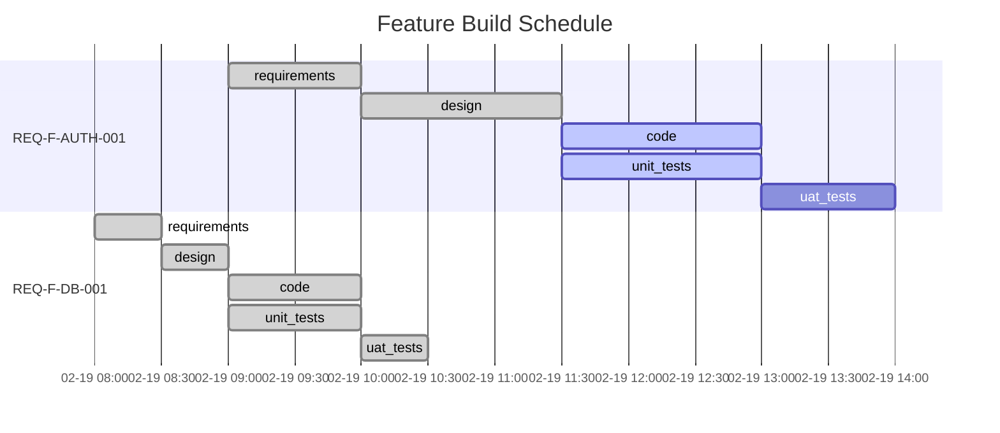

# /gen-status - Show Feature Vector Progress

Display the current state of all feature vectors and their trajectories through the graph. Enhanced with state detection, "you are here" indicators, project rollup, signals, and workspace health.

<!-- Implements: REQ-TOOL-002, REQ-FEAT-002, REQ-UX-003, REQ-UX-005, REQ-UX-006 (Human Gate Awareness — pending escalations count), REQ-UX-007 (Edge Zoom Management), REQ-EVOL-002 (JOIN spec+workspace), REQ-EVOL-005 (Draft Features Queue) -->
<!-- Reference: AI_SDLC_ASSET_GRAPH_MODEL.md v2.9.0 §7.5 Event Sourcing, §7.6 Self-Observation, ADR-012 -->

## Usage

```
/gen-status [--feature "REQ-F-*"] [--verbose] [--gantt] [--health] [--repair] [--functor]
```

| Option | Description |
|--------|-------------|
| (none) | Show summary of all feature vectors with state detection |
| `--feature` | Show detailed status for a specific feature |
| `--verbose` | Show iteration history and evaluator details |
| `--gantt` | Show Mermaid Gantt chart of feature build schedule |
| `--health` | Run Genesis self-compliance and workspace health check (bootloader, invariants, tolerances, events, spawns, stuck detection). **Read-only by default** — reports findings, does not mutate state. |
| `--repair` | Run INTRO-008 gap detection then present F_H gate for retroactive convergence evidence repair. Explicit mutation surface — emits `edge_converged{emission: retroactive}` only after human confirmation. Calls `workspace_repair.repair_convergence_evidence()`. |
| `--functor` | Show functor encoding registry, per-unit categories, and escalation history |

## Instructions

### Step 0: State Detection (always runs first)

Detect the current project state using the same algorithm as `/gen-start`:

1. Check for `.ai-workspace/` directory → UNINITIALISED if missing
2. Check for unresolved mandatory constraints → NEEDS_CONSTRAINTS
3. Check for intent → NEEDS_INTENT
4. Check for active features → NO_FEATURES
5. Check for stuck features (δ unchanged 3+ iterations) → STUCK
6. Check for all blocked → ALL_BLOCKED
7. Check for unconverged edges → IN_PROGRESS
8. Check for all converged → ALL_CONVERGED

Display at the top of output:

```
State: IN_PROGRESS
  What /gen-start would do: iterate REQ-F-AUTH-001 on code↔unit_tests
```

### Default View (No Arguments)

Read `.ai-workspace/features/feature_index.yml` and all feature files to produce:

```
AI SDLC Status — {project_name}
================================

State: IN_PROGRESS
  Start would: iterate REQ-F-AUTH-001 on code↔unit_tests (closest-to-complete)

You Are Here:
  REQ-F-AUTH-001  intent ✓ → req ✓ → design ✓ → code ● → tests ● → uat ○
  REQ-F-DB-001    intent ✓ → req ✓ → design ✓ → code ✓ → tests ✓ → uat ✓
  REQ-F-API-001   intent ✓ → req ● → design ○ → code ○ → tests ○ → uat ○

Project Rollup:
  Edges converged: 12/20 (60%)
  Features:  1 converged, 2 in-progress, 0 blocked, 0 stuck
  Signals:   1 unactioned intent_raised
  Proposals: 2 draft proposals awaiting review
  Functor:   standard/interactive/medium — 0 overrides, 2 η
  Approvals: 5 human, 3 proxy

Active Features:
  feature          title                      edge            iter  δ   H
  ───────────────  ─────────────────────────  ──────────────  ────  ──  ──
  REQ-F-AUTH-001  "User authentication"      design→code     3     2   5
  REQ-F-DB-001    "Database schema"           code↔tests      4     0   4
  REQ-F-API-001   "REST API endpoints"        requirements    1     5   6

Completed Features:
  REQ-F-SETUP-001 "Project scaffolding"       all edges converged

Signals:
  INT-ECO-003 (unactioned) — "dependency update: requests 2.32.0 available"

Draft Proposals Queue:
  PROP-001  high    "Add tests for REQ-F-AUTH-002"       2d ago  → /gen-review-proposal --show PROP-001
  PROP-002  medium  "Telemetry for REQ-F-DB-001"         1d ago  → /gen-review-proposal --show PROP-002
  Use /gen-review-proposal to review. 2 proposals awaiting human gate.

Proxy Decisions (pending morning review):
  3 decisions made since last attended session (2026-03-13T08:00:00Z)
  ┌──────────────────────┬──────────────────────────┬──────────┬──────┐
  │ Feature              │ Edge                     │ Decision │ Age  │
  ├──────────────────────┼──────────────────────────┼──────────┼──────┤
  │ REQ-F-AUTH-001       │ intent→requirements      │ approved │ 4h   │
  │ REQ-F-AUTH-001       │ requirements→design      │ approved │ 3h   │
  │ REQ-F-DB-001         │ intent→requirements      │ approved │ 2h   │
  └──────────────────────┴──────────────────────────┴──────────┴──────┘
  To review: cat .ai-workspace/reviews/proxy-log/{filename}.md
  To override: /gen-review --feature {id} --edge "{edge}"
  To dismiss: add "Reviewed: {date}" line to the log file

Feature Scope (spec→workspace JOIN):
  Spec:     15 features defined
  Workspace: 3 active, 1 completed  (4 total)
  ACTIVE:   REQ-F-AUTH-001, REQ-F-DB-001, REQ-F-API-001, REQ-F-SETUP-001
  PENDING:  11 features in spec not yet started in workspace
  ORPHAN:   0 workspace features not found in spec

Graph Coverage:
  Requirements:  12/15 (80%)
  Design:         8/12 (67%)
  Code:           5/8  (63%)
  Tests:          5/5  (100%)

Next Actions:
  - REQ-F-AUTH-001: iterate on design→code edge
  - REQ-F-API-001: human review pending on requirements
```

#### "You Are Here" Indicators

For each active feature, show a compact graph path using convergence markers:
- `✓` — converged (edge complete)
- `●` — iterating (in progress)
- `○` — pending (not started)
- `✗` — blocked (dependency or stuck)

Only show edges that are in the feature's active profile. Co-evolution edges show as a single unit.

#### Project Rollup

Aggregate across all features:
- Total edges converged / total edges required
- Feature count by status: converged, in-progress, blocked, stuck
- Unactioned signal count (intent_raised events not yet acted upon)
- Project convergence state (see Project Convergence State section below)

#### Project Convergence State (NC-004 — ADR-S-026 §4.5)

Compute the project-level convergence state from all active and completed feature vectors.
This state is derived — never stored. Read feature vectors from `.ai-workspace/features/active/`
and `.ai-workspace/features/completed/`.

**Three-state algorithm**:

```
read all feature vectors from .ai-workspace/features/active/ and completed/

iterating_count   = count(v for v in vectors if v.status == "iterating" or v.status == "in_progress")
required_vectors  = [v for v in vectors if v.disposition not in ("blocked_deferred", "abandoned")]
converged_count   = count(v for v in required_vectors if v.status == "converged")
blocked_no_disp   = count(v for v in vectors if v.status == "blocked" and v.disposition is null)

if iterating_count > 0:
    project_state = ITERATING       # at least one vector actively iterating
elif converged_count == len(required_vectors):
    project_state = CONVERGED       # all required vectors have converged
elif blocked_no_disp > 0:
    project_state = QUIESCENT       # nothing iterating; blocked vectors lack disposition
else:
    project_state = BOUNDED         # quiescent + all blocked explicitly dispositioned
```

**State semantics**:

| State | Meaning | What to do |
|-------|---------|-----------|
| `ITERATING` | Active work in progress | Continue iterating |
| `QUIESCENT` | Work stalled; blocked vectors need disposition | Disposition blocked vectors or escalate |
| `CONVERGED` | All required vectors converged; system complete | Run /gen-gaps; prepare release |
| `BOUNDED` | No active work; all blockers acknowledged | Explicit human decision to resume or release |

**STATUS.md project state section** (write to STATUS.md under the Phase Completion Summary):

```markdown
## Project State

**State**: {ITERATING | QUIESCENT | CONVERGED | BOUNDED}

| State | Count |
|-------|-------|
| Iterating  | {n} vectors |
| Converged  | {n}/{total_required} required vectors |
| Blocked (with disposition) | {n} vectors |
| Blocked (no disposition) | {n} vectors ← needs explicit disposition for BOUNDED |
```

**Health checks** (added to `--health` output):
1. `project_state_consistency` — FAIL if any vector claims `status: converged` with `produced_asset_ref: null`
   - Message: "Convergence claimed without produced asset reference — traceability chain broken"
2. `blocked_disposition_completeness` — WARN if any vector has `status: blocked` with `disposition: null`
   when project claims BOUNDED state
   - Message: "{N} blocked vectors have null disposition — project cannot claim BOUNDED"
3. `convergence_evidence_present` (F_D, ADR-S-037) — FAIL if any feature vector claims `status: converged`
   on an edge where the event stream contains no supporting convergence event:
   ```
   for each feature vector in active/ + completed/:
     for each edge where trajectory[edge].status == "converged":
       search events.jsonl for a terminal convergence event:
         event_type in {edge_converged, ConvergenceAchieved}   ← REQ-EVENT-003 canonical
         AND (feature == vector.feature_id OR instance_id == vector.feature_id)
         AND edge == edge_name
         (iteration_completed alone does NOT satisfy — it is a lifecycle event, not terminal convergence)
       if not found → FAIL, record in health_checked failed_checks list:
                              {check_name: "convergence_evidence_present",
                               feature: feature_id, edge: edge_name,
                               observation: "convergence_without_evidence"}
   ```
   - Message: "Convergence claimed for {feature}/{edge} — no stream evidence. Retroactive evaluation required."
   - Remediation: run real evaluators against the artifacts; if clean, append `edge_converged` with `emission: retroactive`
   - **Output path**: findings are included in the `health_checked` event (REQ-SUPV-003). The INTRO-008
     sensory monitor (running in the sensory service) emits `interoceptive_signal{monitor_id: INTRO-008}`,
     which affect triage routes to `intent_raised{signal_source: convergence_without_evidence}`.
     The health check and the sensory monitor are two invocation paths for the same check — neither
     emits `intent_raised` directly.

**Project Rollup line** (add after feature counts):
```
  State:     {ITERATING|QUIESCENT|CONVERGED|BOUNDED} ({n} iterating, {n}/{total} converged)
```

#### Active Features Table — Hamiltonian Columns (ADR-S-020, T-COMPLY-006)

The Active Features table includes three derived columns from the event log:

| Column | Symbol | Source | Meaning |
|--------|--------|--------|---------|
| `iter` | — | count of `iteration_completed` for this feature | Total iterations spent across all edges (T in phase space) |
| `δ` | V | `delta` field in last `iteration_completed` | Current failing evaluator count (potential energy — work remaining) |
| `H` | H = T + V | computed | Hamiltonian = total traversal cost (sunk + remaining) |

H diagnostics (ADR-S-020 §2):
- H decreasing → healthy convergence
- dH/dt = 0 (H flat, V > 0) → unit-efficient convergence
- dH/dt > 0 → high-friction or stalled (V unchanged while T grows)

Compute H for each feature from `events.jsonl`:
```python
T = count(iteration_completed events for this feature)
V = last delta value from iteration_completed (0 if edge_converged follows)
H = T + V
```

Call `compute_hamiltonian(events, feature_id)` from `genesis.workspace_state` for this derivation.

#### Signals

Read `events.jsonl` for `intent_raised` events that have not been followed by a corresponding `spawn_created` or `spec_modified` event. These are unactioned signals that need human attention.

#### Feature Scope JOIN (REQ-EVOL-002)

Compute the JOIN between the spec definition layer and the workspace trajectory layer:

**Step 1: Collect spec feature IDs**

Read `specification/features/FEATURE_VECTORS.md` and extract all feature IDs:
```bash
grep -oE "REQ-F-[A-Z]+-[0-9]+" specification/features/FEATURE_VECTORS.md | sort -u
```

If the spec file is unreadable, emit a warning: `Feature Scope: spec layer unreadable — JOIN skipped`.

**Step 2: Collect workspace feature IDs**

List all `.yml` files in `.ai-workspace/features/active/` and `.ai-workspace/features/completed/`. Extract the `feature` or `id` field from each file.

**Step 3: Compute JOIN categories**

| Category | Condition | Display |
|----------|-----------|---------|
| ACTIVE | In spec AND in workspace (active) | Show in "You Are Here" section |
| COMPLETED | In spec AND in workspace (completed) | Show in "Completed Features" section |
| PENDING | In spec AND NOT in workspace | Show in Feature Scope section |
| ORPHAN | In workspace AND NOT in spec | Flag as workspace health warning |

**Step 4: Display Feature Scope section**

```
Feature Scope (spec→workspace JOIN):
  Spec:     {N} features defined
  Workspace: {active} active, {completed} completed  ({total} total)
  ACTIVE:   {comma-separated IDs or "all" if >8}
  PENDING:  {N} features in spec not yet started in workspace
  ORPHAN:   {N} workspace features not found in spec{warnings}
```

For PENDING features, list the first 5 IDs. For >5, show "and N more".
For ORPHAN features, always list them explicitly — they are health warnings.
If PENDING = 0 and ORPHAN = 0: show `Coverage: 100% spec features active or completed`.

**Step 5: Add ORPHAN warning to health output**

If ORPHAN count > 0, also add a recommendation to the Next Actions section:
```
  [WARN] {N} ORPHAN workspace features not in spec: {IDs} — archive or add to spec
```

#### Proxy Decisions Queue (REQ-F-HPRX-006, REQ-NFR-HPRX-002)

Read `.ai-workspace/reviews/proxy-log/*.md` and identify entries pending morning review.

**Detection of "pending review"**:
1. Find the timestamp of the last `review_approved{actor: "human"}` event in `events.jsonl` — this is the "last attended session" timestamp. If no such event exists, use epoch (all proxy decisions are pending).
2. Proxy-log files with a file timestamp after the last attended session timestamp are "pending morning review".
3. Files with a `Reviewed: {date}` line are considered dismissed — exclude them.

**Display rules**:
- If 0 pending entries: output `Proxy Decisions: none pending` — positive health signal.
- If entries exist: show count in Project Rollup (`Approvals: N human, M proxy`) and the full table in the Proxy Decisions section.

**Approval counts** (REQ-NFR-HPRX-002): Count `review_approved` events in `events.jsonl` by `actor` field:
- `actor: "human"` (or absent `actor`, treated as `"human"`) → human approval count
- `actor: "human-proxy"` → proxy approval count
- Display in Project Rollup: `Approvals: {n} human, {m} proxy`

**Override**: `/gen-review --feature {id} --edge "{edge}"` re-opens the gate for human evaluation. On human rejection, feature reverts to `iterating` at that edge; the proxy `review_approved` event is superseded.

**Dismiss**: Add a `Reviewed: {ISO-date}` line anywhere in the proxy-log file. `/gen-status` excludes dismissed files from the pending count.

#### Draft Proposals Queue (REQ-EVOL-005)

Read `.ai-workspace/reviews/pending/PROP-*.yml` and list all proposals with `status: draft`. Each entry shows:
- Proposal ID, severity, title, age (days since `created`)
- Quick action: `/gen-review-proposal --show PROP-NNN`

Compute the queue by: listing all YAML files in the pending directory and loading their `status`, `severity`, `title`, `created` fields.

If no pending proposals: output `Proposals: 0 draft proposals (queue empty)` — this is a positive health signal.

If proposals exist: show the count in Project Rollup and the full table in the Draft Proposals Queue section.

#### "What Start Would Do"

Preview the action that `/gen-start` would take, including feature selection reasoning and edge determination. This helps the user understand the routing logic without invoking it.

### Detailed View (--feature)

Read the specific feature vector file and show:

```
Feature: REQ-F-AUTH-001 — "User authentication"
================================================

Intent:  INT-042
Status:  in_progress

Trajectory:
  intent         ✓ converged (2026-02-19T09:00)
  requirements   ✓ converged (2026-02-19T10:00)  [human approved]
  design         ✓ converged (2026-02-19T11:30)  [human approved]
  code           → iterating (iteration 3)       [delta: missing error handling]
  unit_tests     → iterating (iteration 3)       [co-evolving with code]
  uat_tests      ○ pending

Dependencies:
  REQ-F-DB-001   ✓ resolved (database schema available)

Constraint Dimensions (at design edge):
  ecosystem_compatibility  ✓ resolved (ADR-003: Python 3.12 + Django 5.0)
  deployment_target        ✓ resolved (ADR-004: Kubernetes on AWS EKS)
  security_model           ✓ resolved (ADR-005: OAuth2 + RBAC)
  build_system             ✓ resolved (ADR-006: pip + Docker multi-stage)
  data_governance          ~ advisory (acknowledged — GDPR not applicable)
  performance_envelope     ~ advisory (p99 < 200ms target documented)
  observability            ~ advisory (OpenTelemetry planned)
  error_handling           ~ advisory (fail-fast strategy documented)

Context Hash: sha256:a1b2c3...
```

### Gantt Chart View (--gantt)

Read the event stream from `.ai-workspace/events/events.jsonl` (source of truth). Fall back to feature vector files in `.ai-workspace/features/active/` and `.ai-workspace/features/completed/` if the event log doesn't exist yet. Extract timestamps to build a Mermaid Gantt chart.

#### Step 1: Collect Phase Data

For each feature vector file, extract:
- Feature ID and title
- For each trajectory entry (requirements, design, code, unit_tests, uat_tests):
  - `started_at` — when iteration began on this edge
  - `converged_at` — when the edge converged (null if still in progress)
  - `status` — pending, iterating, converged
  - `iteration` — current iteration count

#### Step 2: Generate Mermaid Gantt

Produce a Mermaid Gantt diagram. Each feature is a section; each edge traversal is a task bar.



#### Step 3: Status-to-Gantt Mapping

Map feature vector trajectory status to Gantt task states:

| Trajectory Status | Gantt State | Display |
|-------------------|-------------|---------|
| `converged` | `:done` | Solid bar with start→end timestamps |
| `iterating` | `:active` | Highlighted bar, end = now or estimated |
| `blocked` | `:crit` | Red bar, blocked on dependency or spawn |
| `pending` | (no prefix) | Grey bar, estimated duration |
| `time_box_expired` | `:done` | Solid bar (completed via time-box) |

#### Step 4: Handle Missing Timestamps

- If `started_at` is missing but status is `converged`: use `converged_at - estimated_duration`
- If `converged_at` is missing but status is `iterating`: use current time as provisional end
- For `pending` phases: estimate duration from profile or use 1 hour default, chain with `after {previous_phase_id}`
- Co-evolution edges (code↔unit_tests): show as parallel bars starting at the same time

#### Step 5: Write STATUS.md

Write the full Gantt output to `.ai-workspace/STATUS.md` so it is viewable as a workspace artifact:

1. **Write** `.ai-workspace/STATUS.md` with the following structure:

```markdown
# Project Status — {project_name}

Generated: {ISO timestamp}

## Feature Build Schedule

{Mermaid Gantt chart as a fenced code block}

## Phase Completion Summary

| Phase | Converged | In Progress | Pending | Blocked |
|-------|-----------|-------------|---------|---------|
| requirements | 3 | 1 | 0 | 0 |
| design | 2 | 1 | 1 | 0 |
| code | 1 | 1 | 2 | 0 |
| unit_tests | 1 | 1 | 2 | 0 |
| uat_tests | 0 | 0 | 3 | 1 |
| **Total** | **7** | **4** | **8** | **1** |

## Active Features

{List of active features with current edge and iteration}

## Next Actions

{Recommended next actions from graph topology}

---

## Process Telemetry

{Auto-generated observations from the iterate history}

### Convergence Pattern
- Iteration counts per edge (flag anomalies: 1-iteration convergence, >5 iterations)
- Evaluator pass/skip/fail ratios
- Deterministic check execution vs skip rates

### Traceability Coverage
- REQ key counts: defined vs tagged in code vs tested
- Gaps identified (cross-reference with /gen-gaps output if available)

### Constraint Surface Observations
- $variable resolution: which resolved, which undefined
- Skipped evaluators and why

## Self-Reflection — Feedback → New Intent

{Signals derived from telemetry that could become new intents or methodology improvements}

| Signal | Observation | Recommended Action |
|--------|-------------|-------------------|
| TELEM-NNN | {what the data shows} | {what to do about it} |
```

2. **Report** to the user: print the file path and a one-line summary (e.g., "Status written to `.ai-workspace/STATUS.md` — 3 features, 7/20 phases converged")
3. The file is viewable in VS Code with Mermaid preview extensions, or renderable to PDF via `md2pdf .ai-workspace/STATUS.md`

**Important**: The status command always OVERWRITES `STATUS.md` — it is a derived snapshot, not a log. The source of truth is `events/events.jsonl`.

### Functor Encoding View (--functor)

Show the functor encoding registry for all active features. Reads each feature vector's `functor:` section and the profile encoding.

```
Functor Encoding — {project_name}
===================================

Profile Encoding: standard
  Strategy:  balanced
  Mode:      interactive
  Valence:   medium (η threshold)

Functional Unit Registry:
┌──────────────┬──────────┬────────────────────────────────────────┐
│ Unit         │ Category │ Notes                                  │
├──────────────┼──────────┼────────────────────────────────────────┤
│ evaluate     │ F_D      │ deterministic tests                    │
│ construct    │ F_P      │ agent-generated                        │
│ classify     │ F_D      │ deterministic classification           │
│ route        │ F_H      │ human-directed                         │
│ propose      │ F_P      │ agent-proposed                         │
│ sense        │ F_D      │ deterministic sensing                  │
│ emit         │ F_D      │ category-fixed (always deterministic)  │
│ decide       │ F_H      │ category-fixed (always human)          │
└──────────────┴──────────┴────────────────────────────────────────┘

Feature Overrides:
  REQ-F-AUTH-001: route → F_D (override: emergency path)

Escalation History (η):
┌────────────────────┬──────────┬──────────────┬─────┬─────┬─────────────────────┐
│ Feature            │ Edge     │ Unit         │ From│ To  │ Trigger             │
├────────────────────┼──────────┼──────────────┼─────┼─────┼─────────────────────┤
│ REQ-F-AUTH-001     │ code↔tests│ evaluate    │ F_D │ F_H │ stuck delta 4 iters │
│ REQ-F-API-001      │ req→design│ route      │ F_H │ F_P │ pattern clear        │
└────────────────────┴──────────┴──────────────┴─────┴─────┴─────────────────────┘

Summary: 2 escalations across 2 features, 0 active overrides
```

Data sources:
- Profile encoding: from `.ai-workspace/profiles/{profile}.yml` or `v2/config/profiles/{profile}.yml`
- Feature overrides: from each feature vector's `functor.overrides` field
- Escalation history: from each feature vector trajectory's `escalations` arrays
- Event log: `encoding_escalated` events in `events.jsonl`

### Health Check View (--health)

Run workspace health diagnostics (REQ-UX-005):

```
Workspace Health — {project_name}
===================================

Genesis Self-Compliance:
  ✓ CLAUDE.md contains Genesis Bootloader
  ✓ Graph topology: .ai-workspace/graph/graph_topology.yml (10 nodes, 10 edges)
  ✓ Iterate defined: all edges have evaluator configs in edge_params/
  ✓ Evaluators: all active edges have ≥1 evaluator (3 deterministic, 2 agent, 1 human)
  ✓ Context: project_constraints.yml present, 4/8 mandatory dimensions resolved
  ✗ Tolerances: 2 constraints lack measurable thresholds (performance_envelope, data_governance)

Event Log:
  ✓ events.jsonl exists (342 events)
  ✓ All lines valid JSON
  ✓ All events have required fields (event_type, timestamp, project)
  ✗ 2 events reference unknown feature IDs

Feature Vectors:
  ✓ 4 active feature vectors
  ✓ All feature IDs match REQ-F-* format
  ✗ 1 orphaned spawn (REQ-F-SPIKE-003 — parent REQ-F-AUTH-001 not found)

Convergence:
  ✓ No stuck features (all δ changing)
  ✓ No time-box expirations pending

Constraints:
  ✓ All mandatory dimensions resolved
  ✓ 2/4 advisory dimensions documented

Recommendations:
  1. Add measurable thresholds to performance_envelope and data_governance constraints
  2. Fix orphaned spawn: link REQ-F-SPIKE-003 to correct parent or archive
  3. Investigate 2 events with unknown feature IDs
```

Checks performed:

**Genesis Self-Compliance** (bootloader invariant verification):
- **Bootloader presence**: CLAUDE.md contains `<!-- GENESIS_BOOTLOADER_START -->` marker — the axiom set that constrains LLM reasoning. Without the bootloader, the LLM pattern-matches templates instead of reasoning within the formal system.
- **Invariant 1 — Graph**: `graph_topology.yml` exists and defines ≥1 node and ≥1 edge. Report node/edge counts.
- **Invariant 2 — Iterate**: Every edge in the active graph has a corresponding evaluator config file in `edge_params/`. An edge without evaluator config means `iterate()` has no stopping condition for that transition.
- **Invariant 3 — Evaluators**: Every active edge has at least one evaluator defined (deterministic, agent, or human). Report counts by type. An edge with zero evaluators violates the convergence invariant.
- **Invariant 4 — Context**: `project_constraints.yml` exists and is non-empty. Report resolution status of mandatory dimensions.
- **Tolerance check**: Scan resolved constraints for measurable thresholds. A constraint resolved as a descriptive statement without a numeric or boolean threshold is flagged as "wish, not sensor" per §VIII of the bootloader. This is advisory, not blocking.

How to perform the Genesis Self-Compliance checks:

1. **Bootloader presence**: Read `CLAUDE.md` in the project root. Search for the string `<!-- GENESIS_BOOTLOADER_START -->`. If missing, report failure and recommend re-running the installer.

2. **Graph invariant**: Read `.ai-workspace/graph/graph_topology.yml` (or fall back to the plugin's `config/graph_topology.yml`). Parse YAML, count entries under `nodes:` and `edges:`. Both must be ≥1.

3. **Iterate invariant**: For each edge in the graph topology, check that a corresponding file exists in the plugin's `config/edge_params/` directory (e.g., edge `intent→requirements` maps to `intent_requirements.yml`). List any edges without config.

4. **Evaluator invariant**: For each edge_params file, parse the YAML and count evaluators under `evaluators:` or `checklist:`. Each edge must have at least one. Classify by type: entries with `type: deterministic` or `type: test` count as F_D, `type: agent` as F_P, `type: human` as F_H.

5. **Context invariant**: Check `.ai-workspace/context/project_constraints.yml` exists and is non-empty. Parse it, count mandatory dimensions (those not marked `advisory`), report how many have non-placeholder values.

6. **Tolerance check**: For each resolved constraint in `project_constraints.yml`, check if the value contains a measurable threshold (numeric comparisons, boolean conditions, specific versions, test counts). Descriptive-only values like `"will be addressed later"` or `"planned"` are flagged as missing tolerances. This check is advisory — it produces warnings, not failures.

**Workspace health** (existing checks):
- **Event log integrity**: valid JSON, required fields, no orphan references
- **Feature vector consistency**: valid format, parent/child links resolve, no duplicates
- **Orphaned spawns**: child vectors with broken parent references
- **Stuck detection**: features with δ unchanged for 3+ iterations
- **Constraint resolution**: mandatory dimensions filled at design edge
- **Time-box monitoring**: approaching or expired time boxes
- **Convergence evidence** (ADR-S-037): every converged edge has stream-backed evidence (`convergence_evidence_present` check)

**Event emission** (REQ-SUPV-003 — failure observability):

After all checks complete, emit a `health_checked` event to `events.jsonl`:

```json
{"event_type": "health_checked", "timestamp": "{ISO 8601}", "project": "{project}", "data": {"passed": {n}, "failed": {n}, "failed_checks": ["check_name", "..."], "warnings": ["..."], "genesis_compliant": true|false, "recommendations": ["..."]}}
```

This enables health trending: the LLM evaluator can detect patterns like "same check failing across consecutive health runs" and generate improvement intents. Without this event, health check results exist only in stdout — invisible to the homeostatic loop.

### Repair View (--repair)

Run INTRO-008 gap detection, then present an F_H gate for retroactive evidence repair.

**This is the only mutating operation in gen-status.** All other flags (`--health`, `--gantt`, `--verbose`, `--functor`) are read-only projections.

**Step 1: Detect gaps**

```python
from genesis.fd_sense import sense_convergence_evidence
result = sense_convergence_evidence(workspace_root, events_path)
```

If `result.breached` is False, output: `INTRO-008: no evidence gaps found. No repair needed.` and stop.

**Step 2: Present F_H gate**

```python
from genesis.workspace_repair import format_repair_prompt
print(format_repair_prompt(result.data.gaps))
```

Output format:
```
PROJECTION AUTHORITY REPAIR — {N} gap(s) detected by INTRO-008

  Gap 1: {feature_id} / {edge}
    Claim:    workspace YAML status=converged
    Evidence: no edge_converged terminal event in stream
    Action if approved: append edge_converged{emission: retroactive, executor: human}

  ...

  These gaps predate the INTRO-008 enforcement check.
  Retroactive closure records that convergence occurred; it does not re-validate the work.
  The validity of each repair rests on the accuracy of your confirmation.

  Confirm repairs? [y/n/selective]
  (y = approve all, n = reject all, selective = approve per gap)
```

**Step 3: Collect confirmation**

- `y` — approve all gaps
- `n` — reject all gaps (no events emitted)
- `selective` — present each gap individually, collect per-gap y/n

**Step 4: Call repair_convergence_evidence()**

```python
from genesis.workspace_repair import repair_convergence_evidence, RepairProvenance

provenance = RepairProvenance(
    confirmed_by="{session_id or human_id}",
    basis="human_confirmation_repair",
)
repair_result = repair_convergence_evidence(
    gaps=result.data.gaps,
    provenance=provenance,
    events_path=events_path,
    approved=approved_gap_keys,   # None = all, [] = none
)
```

**Step 5: Report**

```
REPAIR COMPLETE — {n} gap(s) repaired, {m} skipped

  Repaired:
    ✓ {feature_id} / {edge} — edge_converged{emission: retroactive} appended

  Skipped:
    ✗ {feature_id} / {edge} — not confirmed

Re-run gen-status --health to verify INTRO-008 passes.
```

**Repair validity contract**: The emitted `edge_converged` event is only as truthful as the human's attestation. The function records the confirmation — it does not re-validate the work. The `confirmed_by` and `basis` fields in the event provide audit trail.

### Event Sourcing Architecture

The methodology uses **event sourcing** for all observability:

```
Source of Truth              Derived Views (projections)
─────────────────            ──────────────────────────
events/events.jsonl    ───►  STATUS.md          (computed: Gantt, telemetry, self-reflection)
  (append-only JSONL)  ───►  ACTIVE_TASKS.md    (filtered: convergence events as markdown)
                       ───►  features/active/*.yml  (state: latest trajectory per feature)
```

- **Events** are immutable facts: every `iterate()` invocation appends one event
- **Views** are projections that can be regenerated from the event stream at any time
- If a view gets corrupted or lost, replay `events.jsonl` to reconstruct it

### Process Telemetry Guidelines

The telemetry section is NOT free-form commentary. The iterate agent reads `events.jsonl` and produces structured observations:

1. **Convergence Pattern**: Compare iteration counts against profile expectations. Flag 1-iteration convergence (evaluators may be too lenient) and >5 iterations (may indicate blocked or under-specified requirements).
2. **Traceability Coverage**: Count REQ keys at each stage. Report coverage gaps.
3. **Constraint Surface**: Report $variable resolution rates and skipped deterministic checks.
4. **Self-Reflection**: Each TELEM signal is a potential new intent. The methodology observes itself and feeds back — this closes the `Telemetry / Observer → feedback → new Intent` loop in the bootstrap graph.

## Event Schema

Each event in `events.jsonl` follows this schema:

```json
{
  "event_type": "iteration_completed",
  "timestamp": "2026-02-19T10:30:00Z",
  "project": "my-project",
  "feature": "REQ-F-AUTH-001",
  "edge": "intent→requirements",
  "iteration": 2,
  "status": "converged",
  "convergence_type": "standard",
  "evaluators": {
    "passed": 9, "failed": 0, "skipped": 0, "total": 9,
    "details": [{"name": "check_name", "type": "agent", "result": "pass", "required": true}]
  },
  "asset": "specification/REQUIREMENTS.md",
  "context_hash": "sha256:a1b2c3...",
  "delta": 0,
  "source_findings": [
    {"description": "INT-003 'universal applicability' — target domain set undefined",
     "classification": "SOURCE_UNDERSPEC", "disposition": "resolved_with_assumption"}
  ],
  "process_gaps": [
    {"description": "No check for terminology dictionary in requirements",
     "type": "EVALUATOR_MISSING", "action": "Add document_structure check to intent_requirements.yml"}
  ]
}
```

**Note**: All methodology commands emit events — not just `/gen-iterate`. The status command reads ALL event types (`project_initialized`, `edge_started`, `edge_converged`, `spawn_created`, `checkpoint_created`, `review_completed`, `gaps_validated`, `release_created`). See the iterate agent's **Event Type Reference** for the full catalogue.

### Event Fields

| Field | Description |
|-------|-------------|
| `evaluators` | Forward gap detection — checklist pass/fail/skip counts + details |
| `source_findings` | Backward gap detection — ambiguities, gaps, underspecification found in the source asset |
| `process_gaps` | Inward gap detection — missing evaluators, vague criteria, missing context, missing guidance |
| `delta` | Count of failing required checks (forward only) |

Feature vector timestamps (`started_at`, `converged_at`) are derived from the first and last events for a given feature+edge combination.

### Telemetry Projections from Gap Data

The STATUS.md telemetry section aggregates gap data from `events.jsonl`:

- **Source quality**: Count of source findings per edge, per classification. High `SOURCE_GAP` counts on a downstream edge indicate the upstream edge's evaluators are too lenient.
- **Process maturity**: Count of process gaps per type. High `EVALUATOR_MISSING` counts indicate the methodology needs more checks. Declining counts across iterations indicate the methodology is self-improving.
- **Assumption register**: All `resolved_with_assumption` dispositions — these are decisions that should be validated by a human or confirmed by downstream evidence.
