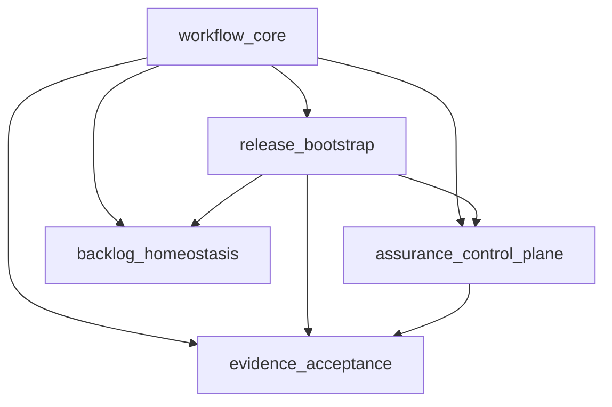

# Abiogenesis Python Module Decomposition

**Status**: Draft
**Authority**: [Abiogenesis Python Variant Design](/Users/jim/src/apps/genesis_sdlc/build_tenants/abiogenesis/python/design/README.md)
**Implements**: `REQ-F-MDECOMP-*`, `REQ-F-GRAPH-*`, `REQ-F-CMD-*`, `REQ-F-GATE-*`, `REQ-F-TAG-*`, `REQ-F-COV-*`, `REQ-F-DOCS-*`, `REQ-F-TEST-*`, `REQ-F-UAT-*`, `REQ-F-CUSTODY-*`, `REQ-F-TERRITORY-*`, `REQ-F-BOOTDOC-*`, `REQ-F-BACKLOG-*`, `REQ-F-ECO-*`, `REQ-F-MVP-*`, `REQ-F-ASSURE-*`, `REQ-F-CTRL-*`
**Purpose**: Module schedule for the Abiogenesis/Python realization of genesis_sdlc

---

## Components

### Component: `workflow_core`

Owns the typed ABG and GTL representation of the 1.0 base process workflow.

Responsibilities:

- declare lifecycle `Node` surfaces
- declare job boundaries and graph manifest output
- export package instantiation and requirements registry surfaces
- export the package and worker surfaces consumed by ABG
- carry markov conditions and graph metadata

### Component: `release_bootstrap`

Owns installation, release wrapping, requirements custody, and compiled bootloader materialization.

Responsibilities:

- install released methodology into a target project
- scaffold `specification/requirements/`
- scaffold the editable project structure from installed master templates
- compose the installed command carrier from gsdlc-owned and engine-owned command surfaces
- generate the wrapper that loads project requirements
- compile and audit the bootloader artifact
- preserve the `.genesis/` vs `.gsdlc/` territory boundary
- publish the install-managed release declaration consumed by the control plane

### Component: `assurance_control_plane`

Owns runtime compilation, backend adapters, doctor, and the exclusive operative runtime path for product commands and live qualification.

Responsibilities:

- compile `.gsdlc/release/` defaults, project-local `specification/design/fp/` tuning, and `.ai-workspace/runtime/` state into one resolved runtime artifact
- own backend schema and adapter boundaries
- probe backend availability and normalize backend results
- expose one shared backend invocation seam for product commands and live qualification
- expose doctor/readiness reporting
- render any effective F_P prompt as a read model derived from the resolved runtime
- delete co-equal legacy prompt/transport runtime branches from the steady-state model

### Component: `evidence_acceptance`

Owns the deterministic and assessed evidence surfaces that prove the workflow is sound.

Responsibilities:

- traceability tags
- REQ coverage checks
- user-guide certification
- integration/E2E evidence
- UAT gate support
- bootloader currency checks
- bundled assurance qualification across fake and live lanes
- persistent run-archive preservation for postmortem and operator review

### Component: `backlog_homeostasis`

Owns the pre-intent holding area and the post-acceptance return path.

This component remains outside the active `0.9.9` refactor wave and is retained here as a later adjacent module.

Responsibilities:

- backlog schema and promotion commands
- ready-item status projection
- publication and operational observation interfaces
- monitoring and homeostatic return surfaces

---

## Interfaces

| Interface | Module | Purpose |
|---|---|---|
| `instantiate(slug, requirements=None)` | `workflow_core` | Materialize the package with project-local requirement custody |
| `package` | `workflow_core` | Export the composed graph and requirement list |
| `worker` | `workflow_core` | Export the worker surface for F_P execution |
| `graph_manifest()` | `workflow_core` | Emit machine-readable asset and edge descriptions |
| `install(target, source, audit_only=False)` | `release_bootstrap` | Install or audit the released methodology |
| `load_project_requirements()` | `release_bootstrap` | Read project requirement families deterministically |
| `synthesize_bootloader()` | `release_bootstrap` | Compile the bootloader artifact from source docs |
| `render_wrapper()` | `release_bootstrap` | Materialize the project-local loader for active requirements |
| `compile_resolved_runtime()` | `assurance_control_plane` | Compile release defaults, project tuning, and runtime state into one resolved runtime artifact |
| `load_resolved_runtime()` | `assurance_control_plane` | Read the active resolved runtime for commands, doctor, and qualification |
| `probe_backends()` | `assurance_control_plane` | Evaluate backend availability through the adapter layer |
| `invoke_backend(prompt, work_folder, backend, timeout)` | `assurance_control_plane` | Execute one bounded F_P turn through the shared adapter layer |
| `doctor()` | `assurance_control_plane` | Report runtime readiness distinct from release audit |
| `render_effective_prompt(manifest_path)` | `assurance_control_plane` | Render an effective F_P prompt as a read model from the resolved runtime |
| `check_tags()` | `evidence_acceptance` | Validate source and test traceability tags |
| `check_req_coverage()` | `evidence_acceptance` | Prove REQ coverage against the active package |
| `sandbox_e2e_passed()` | `evidence_acceptance` | Produce integration/UAT sandbox evidence |
| `uat_accepted()` | `evidence_acceptance` | Surface the final F_H release gate |
| `backlog_list()` | `backlog_homeostasis` | List pre-intent backlog items |
| `backlog_promote()` | `backlog_homeostasis` | Promote backlog signals into the renewal path |
| `status_with_backlog()` | `backlog_homeostasis` | Surface ready backlog counts in operator status output |
| `publish()` | `backlog_homeostasis` | Materialize the post-acceptance publish boundary |
| `record_operational_signal()` | `backlog_homeostasis` | Capture runtime observation for monitoring and return-path evaluation |
| `homeostatic_eval()` | `backlog_homeostasis` | Interpret operational signals into return-path observations |

---

## Decomposition

1. `workflow_core` forms the stable package boundary exported to ABG.
2. `release_bootstrap` depends directly on `workflow_core`.
3. `assurance_control_plane` depends on workflow and release surfaces because it compiles the active runtime from those declarations and project-local tuning.
4. `evidence_acceptance` depends on workflow, release, and control-plane surfaces because it validates both the workflow and the exclusive operative runtime path.
5. `evidence_acceptance` also carries the bundled assurance subsystem that exercises the active tenant as installed rather than certifying a parallel demo surface.
6. `backlog_homeostasis` depends on workflow and release surfaces because `publish` and the return path operate on released artifacts and their operational signals.
7. The module YAML set under `design/modules/` is the schedule surface for implementation.

---

## Dependency Chain

---

## Sequencing

1. `workflow_core` defines the node and edge manifest exported to ABG.
2. `release_bootstrap` sits directly on those stable interfaces.
3. `assurance_control_plane` turns release defaults, project-local tuning, and runtime state into one exclusive operative runtime path.
4. `evidence_acceptance` validates the workflow and release surfaces and operates the bundled qualification harness through that same runtime path.
5. `backlog_homeostasis` closes the return path to `creche` and encodes the post-acceptance lifecycle stages outside the active `0.9.9` refactor wave.

This is a leaf-to-root build order. Lower-rank modules provide the stable interfaces that higher-rank modules build against.

---

## Traceability

| Module | Feature stems | Requirement families |
|---|---|---|
| `workflow_core` | `workflow.base_graph`, `workflow.markov_contracts`, `workflow.requirements_registry` | `REQ-F-GRAPH-*`, `REQ-F-CUSTODY-*`, `REQ-F-MDECOMP-005` |
| `release_bootstrap` | `release.install`, `release.wrapper_generation`, `release.bootloader_compile`, `release.territory_boundary`, `release.command_carrier`, `release.project_templates` | `REQ-F-BOOT-*`, `REQ-F-CUSTODY-*`, `REQ-F-TERRITORY-*`, `REQ-F-BOOTDOC-003` |
| `assurance_control_plane` | `runtime.resolution`, `runtime.backend_adapters`, `runtime.invoke_backend`, `runtime.doctor`, `runtime.prompt_read_model` | `REQ-F-CMD-*`, `REQ-F-CTRL-*`, `REQ-F-BOOT-008`, `REQ-F-BOOT-009`, `REQ-F-BOOT-010` |
| `evidence_acceptance` | `evidence.traceability`, `evidence.documentation`, `evidence.integration_uat`, `evidence.bootloader_validation`, `evidence.assurance` | `REQ-F-TAG-*`, `REQ-F-COV-*`, `REQ-F-DOCS-*`, `REQ-F-TEST-*`, `REQ-F-UAT-*`, `REQ-F-BOOTDOC-*`, `REQ-F-MVP-*`, `REQ-F-ASSURE-*`, `REQ-F-CTRL-006`, `REQ-F-CTRL-008` |
| `backlog_homeostasis` | `homeostasis.backlog`, `homeostasis.publish_loop`, `homeostasis.monitoring_return` | `REQ-F-BACKLOG-*`, `REQ-F-ECO-*` |

Paths listed in `design/modules/*.yml` under `source_files` are anchored at `build_tenants/abiogenesis/python/`.
If a module consumes repo-level inputs outside the variant root, those are listed separately under `consumes_surfaces`.

The per-module YAMLs in `design/modules/` are the canonical design schedule artifacts referenced by this design. Runtime materialization into workspace-local module manifests remains a downstream realization concern.

`REQ-F-CMD-*` and `REQ-F-GATE-*` remain active framework requirements. In this realization they are
satisfied by ABG engine commands operating over `workflow_core.package`, its evaluator declarations,
the install-managed release surfaces, and the assurance control plane, rather than by co-equal
tenant-local legacy runtime branches.

## Transitional Classification

The current refactor wave still passes through some live files that predate the named control-plane module.
They are classified here so no operative surface remains implicit.

The `Classification` column uses the canonical method vocabulary from `SPEC_METHOD.md`.
`Wave state` is supplemental and describes how the file participates in the current in-flight refactor.

| File | Classification | Wave state | Owning module | Replacement / landing |
|---|---|---|---|---|
| `src/genesis_sdlc/release/fp_prompt.py` | `Superseded` | read-model shim while the wave is in flight | `assurance_control_plane` | moves to `src/genesis_sdlc/runtime/prompt_view.py` |
| `tests/e2e/live_transport.py` | `Superseded` | qualification shim while the wave is in flight | `evidence_acceptance` | collapses into the shared `assurance_control_plane.invoke_backend(...)` seam |
| `tests/e2e/sandbox_runtime.py` | `Active` | stable sandbox/install harness | `evidence_acceptance` | remains the sandbox/install harness for qualification |
| `src/genesis_sdlc/workflow/transforms.py` | `Active` | transitional declarative transform-contract seed | `workflow_core` | prompt-read-model and runtime-resolution responsibilities land in `assurance_control_plane` while declarative defaults remain with workflow declaration |
