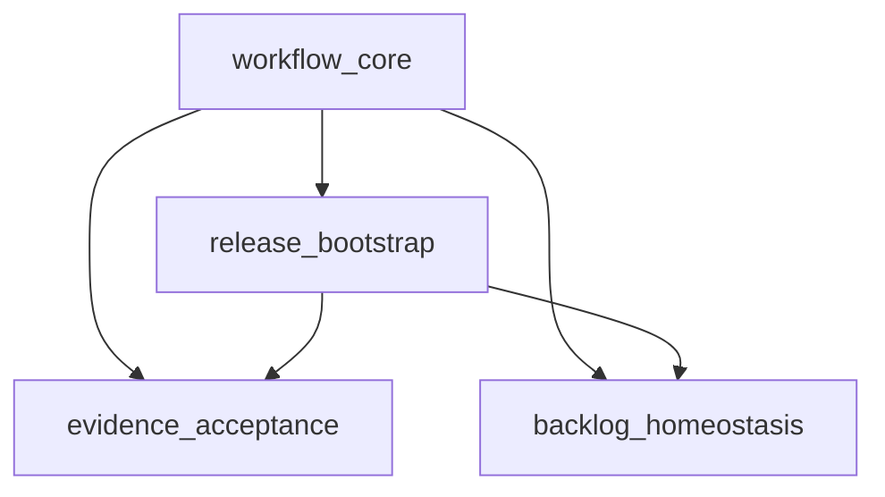

# Abiogenesis Python Module Decomposition

**Status**: Draft
**Authority**: [Abiogenesis Python Variant Design](/Users/jim/src/apps/genesis_sdlc/build_tenants/abiogenesis/python/design/README.md)
**Implements**: `REQ-F-MDECOMP-*`, `REQ-F-GRAPH-*`, `REQ-F-CMD-*`, `REQ-F-GATE-*`, `REQ-F-TAG-*`, `REQ-F-COV-*`, `REQ-F-DOCS-*`, `REQ-F-TEST-*`, `REQ-F-UAT-*`, `REQ-F-CUSTODY-*`, `REQ-F-TERRITORY-*`, `REQ-F-BOOTDOC-*`, `REQ-F-BACKLOG-*`, `REQ-F-ECO-*`
**Purpose**: Module schedule for the Abiogenesis/Python realization of genesis_sdlc

---

## Components

### Component: `workflow_core`

Owns the typed ABG and GTL representation of the 1.0 base process workflow.

Responsibilities:

- declare lifecycle `Node` surfaces
- declare job boundaries and graph manifest output
- export package instantiation and requirements registry surfaces
- export the package and worker surfaces consumed by ABG
- carry markov conditions and graph metadata

### Component: `release_bootstrap`

Owns installation, release wrapping, requirements custody, and compiled bootloader materialization.

Responsibilities:

- install released methodology into a target project
- scaffold `specification/requirements/`
- generate the wrapper that loads project requirements
- compile and audit the bootloader artifact
- preserve the `.genesis/` vs `.gsdlc/` territory boundary

### Component: `evidence_acceptance`

Owns the deterministic and assessed evidence surfaces that prove the workflow is sound.

Responsibilities:

- traceability tags
- REQ coverage checks
- user-guide certification
- integration/E2E evidence
- UAT gate support
- bootloader currency checks

### Component: `backlog_homeostasis`

Owns the pre-intent holding area and the post-acceptance return path.

Responsibilities:

- backlog schema and promotion commands
- ready-item status projection
- publication and operational observation interfaces
- monitoring and homeostatic return surfaces

---

## Interfaces

| Interface | Module | Purpose |
|---|---|---|
| `instantiate(slug, requirements=None)` | `workflow_core` | Materialize the package with project-local requirement custody |
| `package` | `workflow_core` | Export the composed graph and requirement list |
| `worker` | `workflow_core` | Export the worker surface for F_P execution |
| `graph_manifest()` | `workflow_core` | Emit machine-readable asset and edge descriptions |
| `install(target, source, audit_only=False)` | `release_bootstrap` | Install or audit the released methodology |
| `load_project_requirements()` | `release_bootstrap` | Read project requirement families deterministically |
| `synthesize_bootloader()` | `release_bootstrap` | Compile the bootloader artifact from source docs |
| `render_wrapper()` | `release_bootstrap` | Materialize the project-local loader for active requirements |
| `check_tags()` | `evidence_acceptance` | Validate source and test traceability tags |
| `check_req_coverage()` | `evidence_acceptance` | Prove REQ coverage against the active package |
| `sandbox_e2e_passed()` | `evidence_acceptance` | Produce integration/UAT sandbox evidence |
| `uat_accepted()` | `evidence_acceptance` | Surface the final F_H release gate |
| `backlog_list()` | `backlog_homeostasis` | List pre-intent backlog items |
| `backlog_promote()` | `backlog_homeostasis` | Promote backlog signals into the renewal path |
| `status_with_backlog()` | `backlog_homeostasis` | Surface ready backlog counts in operator status output |
| `publish()` | `backlog_homeostasis` | Materialize the post-acceptance publish boundary |
| `record_operational_signal()` | `backlog_homeostasis` | Capture runtime observation for monitoring and return-path evaluation |
| `homeostatic_eval()` | `backlog_homeostasis` | Interpret operational signals into return-path observations |

---

## Decomposition

1. `workflow_core` forms the stable package boundary exported to ABG.
2. `release_bootstrap` depends directly on `workflow_core`.
3. `evidence_acceptance` depends on workflow and release surfaces because it validates both.
4. `backlog_homeostasis` depends on workflow and release surfaces because `publish` and the return path operate on released artifacts and their operational signals.
5. The module YAML set under `design/modules/` is the schedule surface for implementation.

---

## Dependency Chain

---

## Sequencing

1. `workflow_core` defines the node and edge manifest exported to ABG.
2. `release_bootstrap` sits directly on those stable interfaces.
3. `evidence_acceptance` validates the workflow and release surfaces.
4. `backlog_homeostasis` closes the return path to `creche` and encodes the post-acceptance lifecycle stages.

This is a leaf-to-root build order. Lower-rank modules provide the stable interfaces that higher-rank modules build against.

---

## Traceability

| Module | Feature stems | Requirement families |
|---|---|---|
| `workflow_core` | `workflow.base_graph`, `workflow.markov_contracts`, `workflow.requirements_registry` | `REQ-F-GRAPH-*`, `REQ-F-CUSTODY-*`, `REQ-F-MDECOMP-005` |
| `release_bootstrap` | `release.install`, `release.wrapper_generation`, `release.bootloader_compile`, `release.territory_boundary` | `REQ-F-BOOT-*`, `REQ-F-CUSTODY-*`, `REQ-F-TERRITORY-*`, `REQ-F-BOOTDOC-003` |
| `evidence_acceptance` | `evidence.traceability`, `evidence.documentation`, `evidence.integration_uat`, `evidence.bootloader_validation` | `REQ-F-TAG-*`, `REQ-F-COV-*`, `REQ-F-DOCS-*`, `REQ-F-TEST-*`, `REQ-F-UAT-*`, `REQ-F-BOOTDOC-*` |
| `backlog_homeostasis` | `homeostasis.backlog`, `homeostasis.publish_loop`, `homeostasis.monitoring_return` | `REQ-F-BACKLOG-*`, `REQ-F-ECO-*` |

Paths listed in `design/modules/*.yml` under `source_files` are anchored at `build_tenants/abiogenesis/python/`.

The per-module YAMLs in `design/modules/` are the canonical design schedule artifacts referenced by this design. Runtime materialization into workspace-local module manifests remains a downstream realization concern.

`REQ-F-CMD-*` and `REQ-F-GATE-*` remain active framework requirements. In this realization they are
satisfied by ABG engine commands operating over `workflow_core.package`, its evaluator declarations,
and the release/evidence surfaces listed above, rather than by tenant-local runtime modules.
