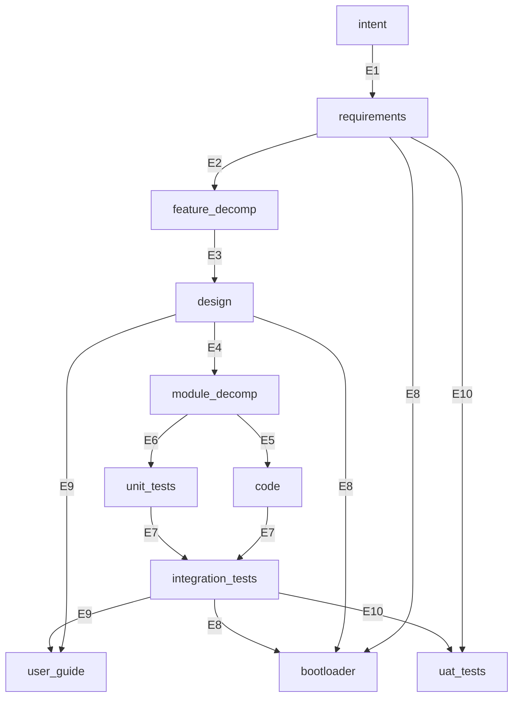

# genesis_sdlc — Intent

**Derived from**: Project need — abiogenesis provides the engine, but no standard SDLC graph package
**Status**: Approved
**Date**: 2026-03-15

---

## INT-001 — Standard SDLC Bootstrap Graph

### Problem

abiogenesis provides a GTL engine — typed asset graphs, convergence loops, evaluators — but it ships no SDLC graph. Every project that adopts genesis must define its own Package from scratch: assets, edges, evaluators, commands. This is like shipping GCC without libc — the compiler works, but every program must reinvent standard library functions.

The result: each project re-derives the same SDLC topology (intent → requirements → design → code → tests), makes different tradeoff decisions, and produces incompatible convergence semantics. There is no shared standard to converge against.

### Value Proposition

genesis_sdlc is a GTL Package that provides the standard SDLC bootstrap graph. A team installs it via `gen-install` and gets:

- **A complete graph**: intent → requirements → feature_decomp → design → module_decomp → code ↔ unit_tests, with evaluators at every edge
- **Convergence guarantees**: every stage has explicit acceptance criteria (F_D deterministic, F_P agent, F_H human). Work is not done until evaluators pass.
- **Traceability**: REQ keys thread from intent through requirements, features, design, code, and tests. Coverage is computable at any time.
- **AI in the right role**: F_D runs first; F_P only when F_D passes; F_H gates stage transitions. No wasted agent calls.
- **Event-sourced state**: all progress recorded in an append-only event log. State derived from events, not mutable objects. Recovery is replay.

### Scope (V1)

The standard SDLC bootstrap graph:

```
intent → requirements → feature_decomp → design → module_decomp → code ↔ unit_tests
```

- Install via `gen-install` — bootstraps `.genesis/` with engine + Package
- Three commands: `gen-gaps` (delta), `gen-iterate` (one cycle), `gen-start` (auto-loop)
- Human approval gates at spec/design boundaries
- REQ key traceability enforced by deterministic checks
- Single worker (claude_code) in V1

### Out of Scope (V1)

- Multi-agent coordination (single worker)
- GUI or web interface (CLI only)
- Package distribution (local install only)

### Success Criteria

1. A fresh project runs `gen-install` and gets a working `.genesis/` with the standard graph
2. `gen-start` drives construction through all edges, producing code + passing tests
3. `gen-gaps` reports `converged: true` and `total_delta: 0` when done
4. All REQ keys trace from spec through code to tests

---

## INT-002 — Module Decomposition and Build Scheduling

### Problem

The `design→code` edge is a single large leap. Design produces ADRs and interface specifications, but the next step — writing code — requires the agent to simultaneously decide module boundaries, dependency order, and implementation. This conflates two distinct concerns: *what modules exist and in what order they must be built* (structural decomposition) versus *how each module is implemented* (construction).

The result: code produced from design tends to be under-decomposed or built in an order that requires rework when upstream modules change.

### Value Proposition

Insert `module_decomp` between design and code:

```
design → module_decomp → code ↔ unit_tests
```

The agent (and the human) approve a build schedule before any code is written. Modules are built leaf-first through to root, so each module is implemented against stable interfaces.

### Scope

- New asset: `module_decomp` with markov: `all_features_assigned`, `dependency_dag_acyclic`, `build_order_defined`
- New edge: `design→module_decomp` with F_D (module_coverage) + F_P (decompose) + F_H (approve schedule)
- Modified edge: `module_decomp→code` replaces `design→code`
- Output: `.ai-workspace/modules/*.yml` — one per module with dependencies and build rank

### Out of Scope

- Basis projections (further decomposition below module level)
- Parallel build scheduling (single worker in V1)

---

## INT-003 — Integration Tests and User Guide as First-Class Graph Assets

### Problem

Two assets that should be on the convergence blocking path are outside the graph:

**Integration tests (sandbox e2e)**: The sandbox run is embedded inside `uat_tests` as an F_P evaluator. This conflates *did the tests pass in a real environment?* (deterministic, repeatable) with *does a human accept the release?* (judgment). A sandbox report is a structured artifact, not a human decision.

**User guide**: `REQ-F-DOCS-001` is in requirements but `user_guide` is not a graph asset. No F_D evaluator checks it. Drift is already visible. A REQ key with no graph binding is unenforceable.

### Value Proposition

Insert two new assets between `unit_tests` and `uat_tests`:

```
code ↔ unit_tests → integration_tests → user_guide → uat_tests
```

- `integration_tests`: sandbox install + `pytest -m e2e` produces structured report. F_D checks the report.
- `user_guide`: F_D checks version string and REQ coverage tags. F_P certifies content.
- `uat_tests`: simplified to pure F_H gate. Human reviews integration report and guide before approving release.

### Scope

- New asset: `integration_tests` with markov: `sandbox_install_passes`, `e2e_scenarios_pass`
- New asset: `user_guide` with markov: `version_current`, `req_coverage_tagged`, `content_certified`
- New edge: `unit_tests→integration_tests` (F_D report check + F_P sandbox runner)
- New edge: `integration_tests→user_guide` (F_D version/coverage + F_P content coherence)
- Modified edge: `user_guide→uat_tests` (pure F_H gate)

### Out of Scope

- Rewriting USER_GUIDE.md content (only adding traceability tags)
- Multiple guide formats
- Automated guide generation

---

## INT-004 — DAG Topology and Bootloader as Compiled Constraint Surface

### Problem

The V1 graph is a linear pipeline masquerading as a DAG:

```
intent → requirements → feature_decomp → design → module_decomp → code ↔ unit_tests
    → integration_tests → user_guide → uat_tests
```

This conflates three distinct relationship types into a single edge chain:

1. **Artifact lineage** (what is this asset intellectually derived from?) is tangled with **evidence prerequisites** (what must be proven before this asset can be accepted?). The user guide's lineage is `[integration_tests]`, but integration tests don't contribute creative content to the guide — design does. Integration tests provide *evidence* that the guide describes a working system.

2. **The bootloader** (`CLAUDE.md` / `SDLC_BOOTLOADER.md`) is a derived document treated as a primary source. It is injected as context on every edge, but nothing in the graph drives its construction, validates its currency, or catches drift when spec/standards/design change. It goes stale silently.

3. **The TDD co-evolve edge** (`code ↔ unit_tests`) imports a work practice into the type system. Tests are a behavioral specification derived from module design, not a co-product of coding. The reflexive edge prevents the graph from being a clean DAG.

The result: edges encode a conveyor belt where real-world dependencies are a DAG; the bootloader drifts without detection; and the graph topology cannot distinguish "this asset needs that content" from "this asset needs that proof."

### Value Proposition

Separate the three relationship types (lineage, evidence, delivery) and make every derived document a graph asset with evaluators:

- **Lineage**: `Asset.lineage` — what creative input produced this asset
- **Evidence prerequisites**: multi-source `Edge.source` — what must converge before the edge fires
- **Delivery**: the partial order implied by the edge DAG — structural, not overridable

The bootloader becomes the 11th graph asset — a compiled constraint surface synthesised from specification, standards, and design, validated by F_D for currency and F_P for content. When the spec changes, `gen-gaps` catches the stale bootloader. No more silent drift.

The graph becomes a clean DAG: 11 assets, 10 edges, four multi-source edges, no reflexive edges.

### Scope

**Target topology** (11 assets, 10 edges):



**Key changes from V1 pipeline:**
- E5 + E6: module_decomp fans out to code and unit_tests in parallel (co-evolve removed)
- E7: `[code, unit_tests] → integration_tests` — consistency proven here
- E8: `[requirements, design, integration_tests] → bootloader` — new asset, leaf node
- E9: `[design, integration_tests] → user_guide` — lineage is design, evidence is integration
- E10: `[requirements, integration_tests] → uat_tests` — decoupled from user_guide

**New asset — bootloader:**
- Compiled constraint surface for LLM consumption (~150-200 lines, 10:1 compression from source docs)
- F_D evaluators: spec hash current, version current, section coverage complete, references valid
- F_P evaluator: regenerate bootloader from source documents
- F_H gate: human approves compiled output
- Leaf node — nothing depends on it. Methodology health is separate from product acceptance.

**Context model cleanup:**
- `sdlc_bootloader` removed as edge context input (it is an output, not an input)
- Source documents referenced directly as edge contexts (spec_requirements, spec_features, operating_standards)

### Out of Scope

- Engine changes for schedule-aware feature traversal (ABG work)
- Graph variant profiles (poc, hotfix, minimal — separate work)
- Multi-agent coordination
- Bootloader content generation prompt (the F_P prompt is a separate deliverable; this intent defines the structure and validation)

### Success Criteria

1. `gen-gaps` on a converged workspace reports 10 edges, all delta=0
2. Changing a REQ key in `requirements.md` causes delta>0 on the bootloader edge — F_D catches staleness
3. The bootloader F_D evaluators catch: wrong spec hash, wrong version, missing section, broken reference
4. The graph renders as a clean DAG — no reflexive edges
5. Clean install into an empty target produces 11 assets, 10 edges, all context paths resolve
