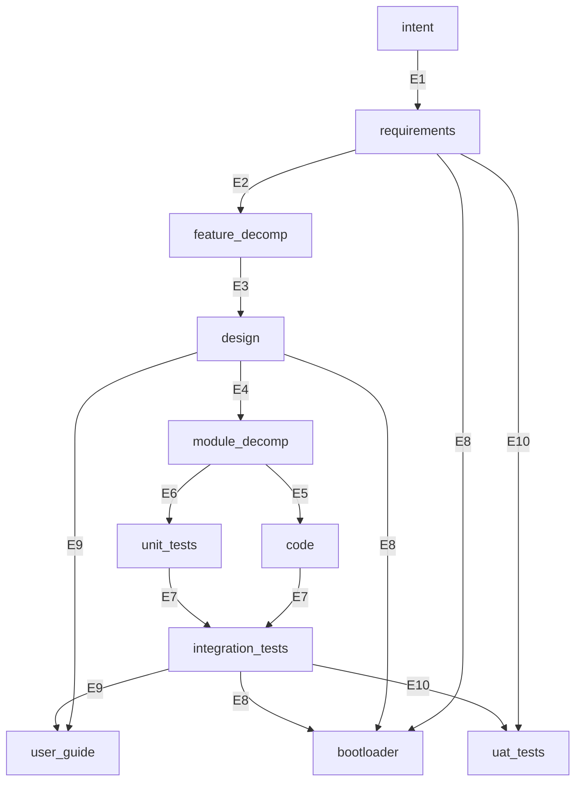

# genesis_sdlc — Intent

**Derived from**: Project need — abiogenesis provides the engine, but no standard SDLC graph package
**Status**: Approved
**Date**: 2026-03-15

---

## INT-001 — Standard SDLC Bootstrap Graph

### Problem

abiogenesis provides a GTL engine — typed asset graphs, convergence loops, evaluators — but it ships no SDLC graph. Every project that adopts genesis must define its own Package from scratch: assets, edges, evaluators, commands. This is like shipping GCC without libc — the compiler works, but every program must reinvent standard library functions.

The result: each project re-derives the same SDLC topology (intent → requirements → design → code → tests), makes different tradeoff decisions, and produces incompatible convergence semantics. There is no shared standard to converge against.

### Value Proposition

genesis_sdlc is a GTL Package that provides the standard SDLC bootstrap graph. A team installs it via `gen-install` and gets:

- **A complete graph**: 11 assets, 10 edges, a clean DAG, and evaluators at every edge
- **Convergence guarantees**: every stage has explicit acceptance criteria (F_D deterministic, F_P agent, F_H human). Work is not done until evaluators pass.
- **Traceability**: REQ keys thread from intent through requirements, features, design, code, and tests. Coverage is computable at any time.
- **AI in the right role**: F_D runs first; F_P only when F_D passes; F_H gates stage transitions. No wasted agent calls.
- **Event-sourced state**: all progress recorded in an append-only event log. State derived from events, not mutable objects. Recovery is replay.

### Scope

The standard SDLC bootstrap graph:

```
intent → requirements → feature_decomp → design → module_decomp
module_decomp → code
module_decomp → unit_tests
[code, unit_tests] → integration_tests
[design, integration_tests] → user_guide
[requirements, design, integration_tests] → bootloader
[requirements, integration_tests] → uat_tests
```

- Install via `gen-install` — bootstraps `.genesis/` with engine and installs the gsdlc methodology surface
- Three commands: `gen-gaps` (delta), `gen-iterate` (one cycle), `gen-start` (auto-loop)
- Human approval gates at spec/design boundaries
- REQ key traceability enforced by deterministic checks

### Out of Scope

- Multi-agent coordination
- GUI or web interface (CLI only)
- Package distribution (local install only)

### Success Criteria

1. A fresh project runs `gen-install` and gets a working `.genesis/` with the standard graph
2. `gen-start` drives construction through all edges, producing code + passing tests
3. `gen-gaps` reports `converged: true` and `total_delta: 0` when done
4. All REQ keys trace from spec through code to tests

---

## INT-002 — Module Decomposition and Build Scheduling

### Problem

The `design→code` edge is a single large leap. Design produces ADRs and interface specifications, but the next step — writing code — requires the agent to simultaneously decide module boundaries, dependency order, and implementation. This conflates two distinct concerns: *what modules exist and in what order they must be built* (structural decomposition) versus *how each module is implemented* (construction).

The result: code produced from design tends to be under-decomposed or built in an order that requires rework when upstream modules change.

### Value Proposition

genesis_sdlc treats `module_decomp` as the structural bridge between design and construction:

```
design → module_decomp
module_decomp → code
module_decomp → unit_tests
```

The agent (and the human) approve a build schedule before any code is written. Modules are built leaf-first through to root, so each module is implemented against stable interfaces.

### Scope

- Asset: `module_decomp` with markov: `all_features_assigned`, `dependency_dag_acyclic`, `build_order_defined`
- Edge: `design→module_decomp` with F_D (module_coverage) + F_P (decompose) + F_H (approve schedule)
- Downstream derivation: `module_decomp→code` and `module_decomp→unit_tests`
- Output: `.ai-workspace/modules/*.yml` — one per module with dependencies and build rank

### Out of Scope

- Basis projections (further decomposition below module level)
- Parallel build scheduling

---

## INT-003 — Integration Tests and User Guide as First-Class Graph Assets

### Problem

Two assets that should be on the convergence blocking path are outside the graph:

**Integration tests (sandbox e2e)**: The sandbox run is embedded inside `uat_tests` as an F_P evaluator. This conflates *did the tests pass in a real environment?* (deterministic, repeatable) with *does a human accept the release?* (judgment). A sandbox report is a structured artifact, not a human decision.

**User guide**: `REQ-F-DOCS-001` is in requirements but `user_guide` is not a graph asset. No F_D evaluator checks it. Drift is already visible. A REQ key with no graph binding is unenforceable.

### Value Proposition

genesis_sdlc treats `integration_tests` and `user_guide` as first-class graph assets on the convergence path:

```
[code, unit_tests] → integration_tests
[design, integration_tests] → user_guide
[requirements, integration_tests] → uat_tests
```

- `integration_tests`: sandbox install + `pytest -m e2e` produces structured report. F_D checks the report.
- `user_guide`: F_D checks version string and REQ coverage tags. F_P certifies content.
- `uat_tests`: simplified to pure F_H gate. Human reviews integration report and guide before approving release.

### Scope

- Asset: `integration_tests` with markov: `sandbox_install_passes`, `e2e_scenarios_pass`
- Asset: `user_guide` with markov: `version_current`, `req_coverage_tagged`, `content_certified`
- Edge: `[code, unit_tests]→integration_tests` (F_D report check + F_P sandbox runner)
- Edge: `[design, integration_tests]→user_guide` (F_D version/coverage + F_P content coherence)
- Edge: `[requirements, integration_tests]→uat_tests` (pure F_H gate)

### Out of Scope

- Rewriting the user-guide artifact content (only adding traceability tags)
- Multiple guide formats
- Automated guide generation

---

## INT-004 — DAG Topology and Bootloader as Compiled Constraint Surface

### Problem

A linear pipeline masquerading as a DAG would look like:

```
intent → requirements → feature_decomp → design → module_decomp → code → integration_tests → user_guide → uat_tests
```

This conflates three distinct relationship types into a single edge chain:

1. **Artifact lineage** (what is this asset intellectually derived from?) is tangled with **evidence prerequisites** (what must be proven before this asset can be accepted?). The user guide's lineage is `[integration_tests]`, but integration tests don't contribute creative content to the guide — design does. Integration tests provide *evidence* that the guide describes a working system.

2. **The agent bootstrap/control surface** is a derived delivery surface treated as a primary source. Whether carried in `CLAUDE.md`, `AGENTS.md`, `SDLC_BOOTLOADER.md`, or another file, it is injected as context on every edge, but nothing in the graph drives its construction, validates its currency, or catches drift when spec/standards/design change. It goes stale silently.

3. **A reflexive code/tests edge** imports a work practice into the type system. Tests are a behavioral specification derived from module design, not a co-product of coding. A reflexive edge prevents the graph from being a clean DAG.

The result: edges encode a conveyor belt where real-world dependencies are a DAG; the bootloader drifts without detection; and the graph topology cannot distinguish "this asset needs that content" from "this asset needs that proof."

### Value Proposition

Separate the three relationship types (lineage, evidence, delivery) and make every derived document a graph asset with evaluators:

- **Lineage**: `Asset.lineage` — what creative input produced this asset
- **Evidence prerequisites**: multi-source `Edge.source` — what must converge before the edge fires
- **Delivery**: the partial order implied by the edge DAG — structural, not overridable

The bootloader is the 11th graph asset — a compiled constraint surface synthesised from specification, standards, and design, validated by F_D for currency and F_P for content. When the spec changes, `gen-gaps` catches the stale bootloader. No more silent drift.

The concrete agent entry/control files become a design concern rather than constitutional truth. Requirements can say that a bootstrap/control surface must exist and ship with the method; design decides whether that is realized through `CLAUDE.md`, `AGENTS.md`, a standalone compiled file, embedded sections, or another lawful carrier. Those carriers should contain only bare operating axioms plus routing to the deeper process documents.

The graph is a clean DAG: 11 assets, 10 edges, four multi-source edges, no reflexive edges.

### Scope

**Target topology** (11 assets, 10 edges):



**Key topology properties:**
- E5 + E6: module_decomp fans out to code and unit_tests in parallel
- E7: `[code, unit_tests] → integration_tests` — consistency is proven here
- E8: `[requirements, design, integration_tests] → bootloader` — bootloader is a leaf asset
- E9: `[design, integration_tests] → user_guide` — lineage is design, evidence is integration
- E10: `[requirements, integration_tests] → uat_tests` — UAT is decoupled from user_guide

**New asset — bootloader:**
- Compiled constraint surface for LLM consumption (~150-200 lines, 10:1 compression from source docs)
- F_D evaluators: spec hash current, version current, section coverage complete, references valid
- F_P evaluator: regenerate bootloader from source documents
- F_H gate: human approves compiled output
- Leaf node — nothing depends on it. Methodology health is separate from product acceptance.

**Context model cleanup:**
- `sdlc_bootloader` removed as edge context input (it is an output, not an input)
- Source documents referenced directly as edge contexts (spec_requirements, spec_features, operating_standards)

**Control-surface boundary:**
- requirements own the need for authoritative agent bootstrap/control delivery
- design owns concrete filenames, placement, and embedding topology for those surfaces

### Out of Scope

- Engine changes for schedule-aware feature traversal (ABG work)
- Graph variant profiles (poc, hotfix, minimal — separate work)
- Multi-agent coordination
- Bootloader content generation prompt (the F_P prompt is a separate deliverable; this intent defines the structure and validation)

### Success Criteria

1. `gen-gaps` on a converged workspace reports 10 edges, all delta=0
2. Changing a REQ key in the live `requirements/` surface causes delta>0 on the bootloader edge — F_D catches staleness
3. The bootloader F_D evaluators catch: wrong spec hash, wrong version, missing section, broken reference
4. The graph renders as a clean DAG — no reflexive edges
5. Clean install into an empty target produces 11 assets, 10 edges, all context paths resolve

---

## INT-005 — SDLC As Ecosystem Lifecycle

### Problem

If the lifecycle stops at `uat_tests`, the framework appears to end at acceptance. That is too narrow. A real software-development process belongs to a larger ecosystem: pre-intent incubation exists before the workflow; accepted artifacts move into operational use after it; operational observations create signals; those signals must be evaluated and returned to the pre-intent holding area.

Without that wider framing, release, operation, monitoring, and renewal look like implementation afterthoughts rather than part of the system’s actual lifecycle.

### Value Proposition

genesis_sdlc treats the 1.0 development workflow as the core of a larger ecosystem lifecycle:

```text
creche -> intent -> requirements -> feature_decomp -> design -> module_decomp
       -> code -> unit_tests -> integration_tests -> user_guide -> uat_tests
       -> publish -> operational_env -> monitoring -> homeostatic_eval -> creche
```

- `creche` is the pre-intent incubation surface
- `publish` is distinct from acceptance
- `operational_env` is the live usage/deployment boundary
- `monitoring` is the operational observation surface
- `homeostatic_eval` turns field signals into actionable observations that return to `creche`

This makes the SDLC explicitly homeostatic rather than a pipeline that terminates at acceptance.

### Scope

- The 1.0 base process workflow remains the development-lifecycle core
- The wider ecosystem lifecycle defines the post-acceptance and pre-intent stages the framework belongs to
- The return path from `monitoring` through `homeostatic_eval` back to `creche` is part of the lifecycle ontology
- Backlog and intent-raising remain the mechanism by which observations re-enter the normal renewal path

### Out of Scope

- Making the Phase 2 ecosystem stages mandatory 1.0 graph assets
- Prescribing one release, deployment, install, CI/CD, or telemetry stack
- Treating automation tooling as a substitute for lifecycle stages

### Success Criteria

1. The specification distinguishes acceptance from publish
2. The specification distinguishes development workflow from operational lifecycle
3. Operational observation has an explicit return path into pre-intent incubation
4. The ecosystem lifecycle is definable without prescribing one automation stack

---

## INT-006 — MVP Freezes The 1.0 Base Workflow And Makes It Operational

### Problem

Without an explicit MVP boundary, the framework can keep absorbing adjacent concerns instead of proving the current workflow as a working product. That causes release drift: scope expands while the real base-process path remains only partially operational.

### Value Proposition

genesis_sdlc treats MVP as a scope freeze over the 1.0 base workflow and proves that frozen workflow operationally:

```text
intent -> requirements -> feature_decomp -> design -> module_decomp
       -> code -> unit_tests -> integration_tests -> user_guide
       -> bootloader -> uat_tests
```

- the active feature set is frozen at the 1.0 base workflow
- MVP is proved by real install-and-converge qualification, not by document completeness alone
- later ecosystem stages remain valid lifecycle truth, but they do not block the MVP boundary

### Scope

- The MVP boundary is the 1.0 base workflow through `uat_tests`
- MVP requires the workflow to install into a fresh sandbox and converge over a minimal project specification
- MVP includes fake-lane and live-lane qualification for the active workflow

### Out of Scope

- Phase 2 ecosystem stages after `uat_tests`
- `backlog_homeostasis` as an RC-blocking implementation target
- Expanding the active feature set beyond the frozen 1.0 workflow

### Success Criteria

1. A fresh sandbox install exposes the active workflow without manual patching
2. A minimal project specification can converge from `intent` through `uat_tests`
3. Fake-lane and live-lane qualification both prove that same frozen workflow boundary
4. The MVP target is posted in the active specification surface rather than held only in tests or commentary

---

## INT-007 — Dual Provenance And Bundled Assurance

### Problem

The first three questions any serious operator asks are:

1. What did it build?
2. Did it build everything?
3. Is it correct?

Those questions cannot be answered strongly if one proof path does all the work. If code, tests, and release evidence all derive from the same narrow surface, the system drifts toward self-certification.

There is also a deeper assumption boundary: assurance can only prove realization against the active intent and requirement surfaces. It cannot rescue a project whose intent or requirements are themselves wrong.

### Value Proposition

genesis_sdlc carries two complementary provenance paths inside one workflow:

- a design path: `design -> module_decomp -> code` and `design -> module_decomp -> unit_tests`
- a requirements-facing path: `requirements -> integration_tests -> user_guide -> uat_tests`

These paths meet at integration and release acceptance:

- `integration_tests` proves the design realization behaves as required in one runnable flow
- `user_guide` and `uat_tests` prove the operator-facing release surface against the active requirement truth

The framework also carries a bundled assurance surface that can qualify the workflow in two ways:

- fake-lane proof for workflow law
- live-lane proof for real F_P execution

Persistent run archives preserve the evidence needed to answer the three operator questions directly.

### Scope

- The dual-proof model is part of the 1.0 workflow rationale
- The assurance surface is bundled with the active build tenant rather than treated as an external demo harness
- Qualification archives preserve artifact provenance, convergence status, and correctness evidence

### Out of Scope

- Proving that approved intent or requirements are business-correct in the first place
- Treating one proof path as sufficient for all three operator questions
- Making the assurance surface a separate product outside the framework

### Success Criteria

1. The active specification distinguishes the design realization path from the requirements-facing acceptance path
2. Qualification archives can answer what was built, whether the frozen workflow fully converged, and what evidence certified correctness
3. Fake-lane and live-lane qualification remain two realizations of one assurance contract, not unrelated test styles
4. The bundled assurance surface is described in active design rather than implied only by the test tree

---

## INT-008 — Assurance Control Plane Makes The Product Operationally Configurable

### Problem

The framework now has enough working parts to prove the base lifecycle, but it still lacks one clear operational layer. Runtime declaration, edge tuning, backend choice, command behavior, audit, and live qualification exist as scattered surfaces. That makes the product harder to operate and harder to explain.

The missing question is not "can the workflow run?" It is:

- how is the runtime resolved?
- why did this backend or profile win?
- which surfaces are managed release state, which are project truth, and which are mutable runtime state?

Without that clarity, the product remains a strong proof rather than a fully operational pre-1.0 release.

### Value Proposition

genesis_sdlc treats the next milestone as an assurance control plane over the existing workflow:

- installed release defaults remain under `.gsdlc/release/`
- tenant-local edge tuning remains under `build_tenants/<techlabel>/design/fp/`
- runtime, operator, and session state live under `.ai-workspace/runtime/`
- one deterministic compile step produces a resolved runtime artifact
- backend selection becomes an explicit adapter-based runtime decision rather than ad hoc transport branching
- `doctor` becomes the runtime-readiness counterpart to install `audit`

This makes the product operationally configurable and inspectable without yet introducing the second-order memory system.

The control plane governs the execution envelope, not the substantive solution strategy. It constrains runtime legality and diagnosis while leaving constructive freedom to the active agent within declared edge boundaries.

### Scope

- Define the assurance control plane as a first-class product concept
- Preserve the current narrow tenant-local customization seam at `build_tenants/<techlabel>/design/fp/`
- Introduce deterministic runtime resolution into one machine-readable runtime artifact
- Separate install-managed release declaration from mutable runtime/session policy
- Define explicit backend adapter and doctor/readiness surfaces

### Out of Scope

- Second-order memory, compaction, and promotion logic
- Replacing the current `build_tenants/<techlabel>/design/fp/` seam with a broader runtime tree before the control plane is proven
- Treating `.gsdlc/release/active-workflow.json` as a mutable session override surface
- Turning runtime profiles, backend adapters, or backend preferences into constitutional project truth or prescribed solution method

### Success Criteria

1. The active specification distinguishes installed release declaration, tenant-local edge tuning, and mutable runtime/session state
2. The product can compile its runtime into one inspectable resolved artifact with provenance for winning values
3. Backend execution is expressed through a product adapter contract rather than hardcoded transport branching
4. `doctor` can explain runtime readiness as a separate concern from release-integrity audit
5. The control plane is complete enough to serve as the foundation for a later second-order memory system rather than embedding that logic prematurely

---

## INT-009 — Multiple Workers And Role Assignment Are First-Class Runtime Configuration

### Problem

GTL and ABG already distinguish roles, executable jobs, and worker capability, but the current genesis_sdlc realization still collapses execution to one exported worker surface plus one winning backend hint. That is enough for a proof lane, but it is not enough for a real product.

The missing question is not "can one agent run the workflow?" It is:

- which worker is assigned to which role?
- which backend is bound to that worker?
- where is that assignment configured, resolved, and proven?
- how do archives answer who actually performed a constructive turn?

Without that layer, `claude`, `codex`, and future workers such as `gemini` are not yet first-class runtime citizens. The product remains effectively single-worker even when it can switch backend transport.

### Value Proposition

genesis_sdlc treats the next execution refactor as explicit worker assignment over the control plane:

- graph law keeps generic roles such as `constructor`
- the installed runtime exposes declared workers and their role coverage
- the control plane resolves `role -> worker -> backend` into the resolved runtime artifact
- product commands and qualification bind the active worker from that resolved assignment
- archives and events distinguish engine build identity from assigned worker identity and backend identity

This preserves the declarative framework boundary while making multiple concrete workers real configuration rather than ad hoc branching.

### Scope

- expose declared workers and default role assignments as installed runtime configuration
- allow runtime/session override of role assignment without mutating install-managed declarations
- compile worker assignment and backend binding into the resolved runtime artifact, with backend identity derived from the winning worker assignment
- make commands and qualification consume that resolved worker assignment
- preserve distinct provenance for engine build, assigned worker, and transport backend

### Out of Scope

- automatic worker optimization or learning between vendors
- forcing all vendors to have identical capabilities
- turning worker preference into constitutional project truth
- changing graph law just to add a new worker implementation

### Success Criteria

1. The active runtime can declare and resolve more than one concrete worker without graph changes
2. Worker assignment is explicit, inspectable, and provenance-bearing in the resolved runtime
3. Product commands and live qualification bind workers through the same resolved assignment path
4. Archives can answer engine build identity, assigned worker identity, and backend identity separately
5. Adding a new conforming worker does not require rewriting the lifecycle graph
