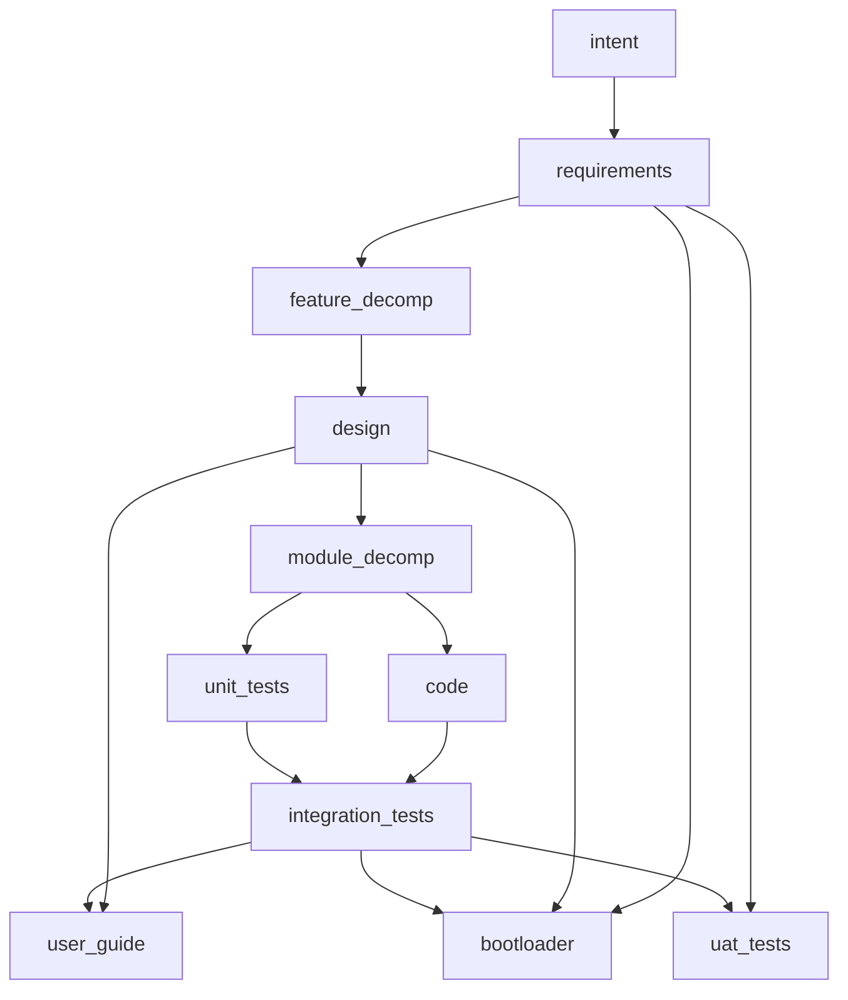

# Base Process Workflow Requirements

**Family**: REQ-F-GRAPH-*
**Status**: Active
**Category**: Capability

This family defines the base process workflow that genesis_sdlc must realize as a framework.

The requirement truth here is the lifecycle shape and asset stability model of the software-development process itself.

A graph is the framework encoding of that workflow. The requirement does not prescribe one engine, one build tenant, or one file path.

### REQ-F-GRAPH-001 — The framework realizes the base process workflow as a typed lifecycle graph

The framework realizes the base process workflow as a typed lifecycle graph with admissible transitions. The graph is a clean DAG with no reflexive edges. Each edge explicitly separates creative input (lineage) from evidence prerequisites (convergence gates).

**Acceptance Criteria**:
- AC-1: Eleven lifecycle assets: `intent`, `requirements`, `feature_decomp`, `design`, `module_decomp`, `code`, `unit_tests`, `integration_tests`, `user_guide`, `bootloader`, `uat_tests`
- AC-2: Ten lifecycle edges with the DAG topology: E1 `intent→requirements`, E2 `requirements→feature_decomp`, E3 `feature_decomp→design`, E4 `design→module_decomp`, E5 `module_decomp→code`, E6 `module_decomp→unit_tests`, E7 `[code, unit_tests]→integration_tests`, E8 `[requirements, design, integration_tests]→bootloader`, E9 `[design, integration_tests]→user_guide`, E10 `[requirements, integration_tests]→uat_tests`
- AC-3: Each edge has at least one evaluator
- AC-4: Four multi-source edges (E7, E8, E9, E10). No reflexive or co-evolving edges. The graph is a DAG.
- AC-5: A conformant realization exposes a loadable workflow definition and a machine-readable description whose asset and edge set satisfy AC-1 through AC-4

### REQ-F-GRAPH-002 — Asset.markov conditions are lifecycle acceptance criteria

Each lifecycle asset defines its own stability conditions.

**Acceptance Criteria**:
- AC-1: Every lifecycle asset in a conformant realization has a non-empty `markov` list of named conditions
- AC-2: Markov conditions are surfaced in the operative output contract for that asset
- AC-3: An asset is stable when all markov conditions are met and all edge evaluators pass
